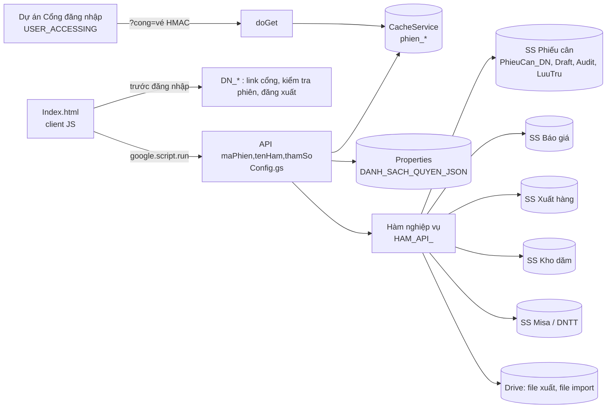
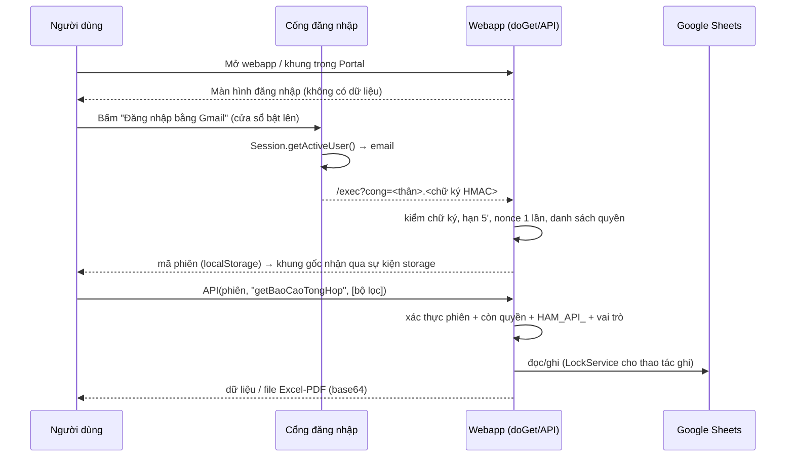

# BÁO CÁO ĐÁNH GIÁ KỸ THUẬT — HỆ THỐNG QUẢN LÝ CÂN / NHẬP–XUẤT KHO HAKGROUP

Phiên bản đánh giá: 2.0.0 (nhánh `claude/fix-webapp-cleanup-p8wzjn`) · Ngày: 26/09/2026

> Phạm vi: toàn bộ mã nguồn trong repo — `Code.gs` (≈4.950 dòng), `Config.gs` (≈1.150 dòng),
> `Index.html` (≈4.900 dòng: HTML + CSS + JS), `appsscript.json`, cùng Portal `MAIN_HAK` (chỉ đọc để
> kiểm tra việc nhúng). Mọi kiểm thử chạy trên **môi trường giả lập** Apps Script (Node `vm`) và
> trình duyệt thật (Chromium/Playwright) với `google.script.run` giả lập — **chưa chạy trên Google thật**.

---

## 1. Tổng quan dự án (Project Review)

| Hạng mục | Hiện trạng |
|---|---|
| Nền tảng | Google Apps Script (V8) Web App, HtmlService, dữ liệu trên 5 Google Spreadsheet |
| Chạy dưới quyền | `USER_DEPLOYING` (tài khoản Admin), truy cập `ANYONE` (cần tài khoản Google) |
| Xác thực | Cổng đăng nhập Gmail riêng (dự án Apps Script thứ 2) → vé HMAC-SHA256 5 phút, dùng 1 lần → phiên CacheService (trượt 6h, tối đa 12h) |
| Phân quyền | ADMIN / NHANVIEN / CHIXEM, kiểm tra ở `API()` mỗi lần gọi |
| Nghiệp vụ | Import phiếu cân nhập (Excel), nhập tay, báo cáo tổng hợp/đơn giá/Misa, báo giá, kho dăm (nhập/xuất/độ khô/kỳ vét bãi/tồn kho), xuất hàng & đơn hàng xuất bán, báo cáo xuất kho, dashboard, lưu trữ theo năm |
| Tích hợp | Portal `MAIN_HAK` nhúng qua iframe; xuất Excel/PDF qua Drive export |

### 1.1 Cấu trúc dự án

```
QL_NHAPKHO_HAK_WEBAPP/
├── appsscript.json      Manifest: V8, Drive v2, USER_DEPLOYING, ANYONE, 3 scope
├── Config.gs            Cấu hình (ID Sheet/Folder, định dạng vùng miền, Misa mặc định),
│                        liên kết dữ liệu, chia sẻ Drive, PHÂN QUYỀN + CỔNG ĐĂNG NHẬP + API()
├── Code.gs              Nghiệp vụ, chia 8 PHẦN:
│   ├── doGet            Trang + nhận vé Cổng
│   ├── PHẦN 1/1B/1C     Import phiếu cân, nhập tay, lưu trữ theo năm
│   ├── PHẦN 2/kỹ thuật  Misa, tính giá
│   ├── PHẦN 4           Báo cáo tổng hợp / đơn giá / Misa / dashboard / xuất file
│   ├── PHẦN 5           Báo giá (BG_*)
│   ├── PHẦN 6           Kho dăm (processFormData + xuLy*/lay*)
│   ├── PHẦN 7           Xuất hàng, đơn hàng xuất bán (XH_*)
│   └── PHẦN 8           Báo cáo xuất kho (XH_*)
├── Index.html           Toàn bộ giao diện (CSS + 8 view + JS client ≈3.200 dòng)
├── tests/               Kiểm thử tự động (KHÔNG đưa vào Apps Script)
└── docs/                Tài liệu
```

### 1.2 Quan hệ module



### 1.3 Luồng dữ liệu chính



### 1.4 Luồng giao diện

Dashboard → Import (phiếu cân nhập / xuất) → Nhập liệu (gỗ keo tay, dăm, xuất bán/trung chuyển, đơn hàng, danh mục kho, độ khô, kỳ vét bãi) → Báo cáo tổng hợp kho (nhập qua cân, Misa, xuất qua cân, xuất Misa, tồn kho theo kho / kỳ) → Quản lý báo giá (nhập, hiệu lực, mã báo giá, mã KL) → Hệ thống (quy trình, hướng dẫn, cấu hình*, người dùng & cổng*, lưu trữ*). (*) chỉ Admin. Vai trò Chỉ xem: ẩn Import, Nhập liệu, Nhập báo giá và mọi nút ghi.

---

## 2. Đánh giá kiến trúc (thang ★5)

| Tiêu chí | Trước | Sau | Nhận xét |
|---|---|---|---|
| Architecture | ★★ | ★★★ | Monolith 3 file lớn; nay có 1 cổng API duy nhất, danh sách hàm tường minh, phân lớp xác thực rõ |
| Code Organization | ★★ | ★★½ | Chia PHẦN bằng chú thích; chưa tách file theo module (xem Lộ trình) |
| Maintainability | ★★ | ★★★ | Chú thích tiếng Việt rất chi tiết; có kiểm thử tự động |
| Scalability | ★★ | ★★½ | Sheets làm CSDL; có lưu trữ theo năm; đọc toàn sheet ở nhiều báo cáo |
| Security | ★ | ★★★★ | Từ "ai có link đều gọi được mọi hàm" → phiên + vai trò + allowlist + chống chèn công thức |
| Performance | ★★★ | ★★★ | Đã batch ghi phần lớn; còn đọc full sheet |
| Extensibility | ★★ | ★★½ | Thêm hàm mới: 2 bước rõ ràng (yeuCauPhien_ + HAM_API_) |
| UI | ★★★½ | ★★★½ | Nhất quán, có toast/overlay/empty-state; chưa dark mode |
| UX | ★★★ | ★★★½ | Đăng nhập 1 chạm trong Portal, tải file trực tiếp |
| Naming / Style | ★★★ | ★★★ | Tiếng Việt không dấu nhất quán ở phần mới; phần cũ trộn Anh–Việt (`BG_getQuoteList` / `layBaoCaoTonKho`) |
| SOLID / DRY / KISS | ★★ | ★★½ | Gộp tiện ích xóa khối dòng, chống công thức; còn lặp logic đọc sheet/định dạng ngày |
| Error Handling | ★★★ | ★★★½ | Mẫu `{status, message}` thống nhất phần lớn; Kho dăm cũ trả chuỗi "❌/✅" |
| Logging | ★★ | ★★★½ | Nhật ký Audit có người thực hiện, ghi nguyên tử, cắt nội dung dài |

---

## 3. Báo cáo lỗi (Bug Report)

Mức độ: 🔴 Nghiêm trọng · 🟠 Cao · 🟡 Trung bình · 🟢 Thấp. Trạng thái: ✅ đã sửa · 📌 đưa vào lộ trình.

### 3.1 Lỗi đã sửa trong các đợt trước của phiên làm việc này

| # | Mức | Lỗi | Trạng thái |
|---|---|---|---|
| B01 | 🔴 | Webapp ai có link cũng gọi được mọi hàm, không đăng nhập | ✅ Cổng đăng nhập + phiên + `API()` |
| B02 | 🔴 | Tài khoản nhân viên không vào được ("chưa được phân quyền API") do `USER_ACCESSING` đòi từng người cấp quyền Drive toàn bộ | ✅ `USER_DEPLOYING` + Cổng |
| B03 | 🟠 | Nhiều chỗ `innerHTML` chèn dữ liệu chưa escape (XSS) | ✅ `escapeHtml/jsAttr` |
| B04 | 🟠 | Import nhiều file chỉ xử lý file đầu | ✅ `step1_PreviewDraft(fileDataList)` |
| B05 | 🟠 | Link xuất Excel/PDF là file Drive của Admin → nhân viên không mở được | ✅ Máy chủ tải sẵn, trả base64, trình duyệt tự tải |
| B06 | 🟠 | Sửa phiếu kho dăm đã bị xóa thì âm thầm tạo phiếu trùng | ✅ |
| B07 | 🟡 | ID Spreadsheet viết cứng trong `xuLyNhapSanPhamSanXuat` | ✅ dùng CONFIG |
| B08 | 🟡 | So khớp email Gmail sai khi có dấu chấm / `+` | ✅ `chuanHoaEmailSoSanh_` |
| B09 | 🟡 | Đăng nhập trong Portal kéo cả Portal sang trang khác | ✅ Cửa sổ bật lên + nhận phiên qua `storage` |

### 3.2 Lỗi phát hiện & sửa trong đợt rà soát này

| # | Mức | Lỗi | Kịch bản gây lỗi | Sửa |
|---|---|---|---|---|
| B10 | 🟠 | `API()` cho gọi **mọi** hàm công khai có `yeuCauPhien_()`, kể cả hàm nội bộ (`xuLySuaXoaGiaoDich`, `taoPhieuDieuChinhKho`, `xuLyKyVetBai`...) | Nhân viên gọi thẳng qua console → **bỏ qua LockService và Nhật ký** của `processFormData`, ghi đồng thời làm hỏng dữ liệu, không để lại vết | ✅ Danh sách tường minh `HAM_API_` (78 hàm); 2 lớp kiểm tra |
| B11 | 🟠 | Sửa/Xóa **đơn hàng xuất bán** theo số dòng ghi nhớ lúc tải danh sách | A mở danh sách; B xóa 1 đơn phía trên; A bấm Xóa → **xóa nhầm đơn kế tiếp** | ✅ Gửi kèm STT; máy chủ kiểm tra/tìm lại theo STT (`XH_timDongDonHang_`) |
| B12 | 🟠 | STT đơn hàng = số dòng → **trùng STT** sau khi xóa 1 đơn ở giữa | 5 đơn, xóa đơn 3, thêm đơn mới → 2 đơn STT 6 | ✅ STT = max + 1 |
| B13 | 🟠 | Xóa **kỳ vét bãi** theo số dòng client gửi, không kiểm tra | Gửi `rowIndex:1` → xóa **dòng tiêu đề**; gửi dòng kỳ cũ → phá khóa sổ | ✅ Chỉ xóa đúng dòng "Thông số kho" mới nhất |
| B14 | 🟠 | **Formula/CSV Injection khi xuất file**: dữ liệu đã được "sanitize" khi nhập (lưu dạng chữ) nhưng khi đọc ra rồi ghi sang file xuất, Sheets tính lại thành công thức | Tên khách hàng `=HYPERLINK(...)` → file Excel gửi đối tác chứa công thức | ✅ `chongCongThuc_` cho 3 luồng xuất (bảng tạm, Misa gốc, báo giá) |
| B15 | 🟡 | Nhật ký Audit tự tính `getLastRow()+1` → 2 thao tác cùng lúc **ghi đè cùng 1 dòng** (mất log); nội dung > 50.000 ký tự làm lỗi và mất log | Lưu danh sách quyền lớn + thao tác khác đồng thời | ✅ `appendRow` (nguyên tử), cắt bớt, chống công thức |
| B16 | 🟡 | Xóa báo giá xóa **từng dòng** (`deleteRow` trong vòng lặp) | Báo giá 100 nhóm giá = 100 lượt gọi API chậm, dễ quá thời gian | ✅ `xoaCacDong_` gom khối liền nhau (dùng chung với Chốt sổ năm) |
| B17 | 🟢 | Hàm chết `yeuCauDangNhap_` | — | ✅ Xóa |

### 3.3 Còn tồn tại (đưa vào lộ trình)

| # | Mức | Vấn đề | Đề xuất |
|---|---|---|---|
| R01 | 🟡 | Module Kho dăm (mã cũ) dùng `alert()` (40 chỗ) & `onclick=""` nội tuyến (34 chỗ), trả chuỗi thay vì `{status}` | Chuyển sang toast + `addEventListener` + chuẩn `{status,message}` |
| R02 | 🟡 | Các báo cáo đọc **toàn bộ** sheet (`getDataRange` ×34) rồi lọc | Chỉ mục theo ngày (cột ngày đã sắp xếp → tìm nhị phân dải dòng) + CacheService cho danh mục |
| R03 | 🟡 | Ngày giờ dùng lẫn `"GMT+7"` và `Session.getScriptTimeZone()` | Một hàm định dạng ngày dùng chung theo `appsscript.json` timeZone |
| R04 | 🟢 | Tên sheet, tên công ty (`COMPANY_NAME`), email Admin mặc định viết cứng | Trang "Thiết lập doanh nghiệp" (xem Lộ trình — thương mại hóa) |
| R05 | 🟢 | Không có dark mode, thiếu thuộc tính `aria-*`, nhiều `style=""` nội tuyến (211) | Hệ thống thiết kế dùng biến CSS |

---

## 4. Báo cáo hiệu năng

| Hạng mục | Hiện trạng | Đánh giá |
|---|---|---|
| Đọc Sheets | Đa số đọc 1 lần bằng `getValues()` dải lớn rồi xử lý trong bộ nhớ | Tốt (đúng khuyến nghị) |
| Ghi Sheets | Import ghi 1 lần `setValues` theo lô; sửa 1 dòng gộp ô liền nhau | Tốt |
| Xóa nhiều dòng | Nay gom khối `deleteRows` | Tốt |
| LockService | Mọi luồng ghi quan trọng có khóa script (hết thời gian chờ → báo "Hệ thống đang bận") | Tốt |
| CacheService | Phiên, vé Cổng, danh sách tên kho | Có thể mở rộng cho danh mục báo giá/mã KL |
| Client | 1 trang, tải lười (lazy load) theo tab; tải file từ base64 | Tốt; file HTML 311KB tải 1 lần |
| Quota | UrlFetch (xuất file) ~1 lượt/lần xuất; Drive tạo file tạm mỗi lần xuất | Chấp nhận được; file tạm tích lũy trong thư mục (báo giá dùng làm bản lưu) |

### Ước lượng quy mô dữ liệu (sheet Phiếu cân 27 cột)

| Số dòng | Import | Báo cáo tổng hợp | Dashboard | Ghi chú |
|---|---|---|---|---|
| 100 | < 3 giây | < 2 giây | < 2 giây | |
| 1.000 | 3–6 giây | 2–4 giây | 2–4 giây | |
| 10.000 | 5–15 giây | 4–10 giây | 4–10 giây | Bình thường |
| 100.000 | 15–40 giây | 15–45 giây | 15–45 giây | Chạy được trong giới hạn 6 phút nhưng chậm; **nên Chốt sổ năm** (lưu trữ) để sheet chính < 30.000 dòng |

Giới hạn cứng của Google: 10 triệu ô / spreadsheet (≈ 370.000 dòng × 27 cột, tính cả sheet lưu trữ vì lưu trữ nằm cùng file), 6 phút / lần thực thi, 30 lượt thực thi đồng thời / người. Đây là giới hạn nền tảng — vượt ngưỡng cần chuyển CSDL (xem Lộ trình giai đoạn 3).

*Số liệu thời gian là ước lượng theo tốc độ đọc/ghi Sheets điển hình, chưa đo trên dữ liệu thật.*

---

## 5. Báo cáo bảo mật

| Hạng mục | Cơ chế | Đánh giá |
|---|---|---|
| Authentication | Cổng Apps Script (USER_ACCESSING, chỉ scope email) → vé HMAC-SHA256, hạn 5 phút, nonce dùng 1 lần, so sánh chữ ký thời gian hằng | ★★★★ |
| Session | Mã 256-bit ngẫu nhiên, CacheService, trượt 6h, tối đa 12h, đăng xuất hủy ngay | ★★★★ |
| Authorization | Mỗi lời gọi: phiên hợp lệ → email **còn** trong danh sách (thu hồi tức thì) → hàm trong `HAM_API_` → có `yeuCauPhien_()` → vai trò (Admin: `yeuCauQuyenAdmin_`; Chỉ xem: `HAM_CHO_PHEP_CHI_XEM_`) | ★★★★½ |
| Spreadsheet permission | Nhân viên không cần quyền Sheet/Drive; khuyến nghị thu hồi quyền cũ (có công cụ trong trang Người dùng) | ★★★★ |
| Bí mật | Khóa Cổng trong Script Properties; chỉ hiện trong nhật ký chủ dự án hoặc trang Admin; có nút đổi khóa | ★★★½ |
| Audit log | Mọi thao tác ghi + đăng nhập (thành công/từ chối) + xem/đổi cấu hình Cổng, có email người thực hiện | ★★★★ |
| Input validation | Email, vai trò, link Cổng, ngày, số lượng > 0 | ★★★ |
| Escape HTML | `escapeHtml`, `jsAttr`; JSON nhúng trang chặn `</script>` | ★★★★ |
| Formula/CSV Injection | Khi nhập (`sanitize`) + khi xuất (`chongCongThuc_`) + nhật ký | ★★★★ |
| Backup/Restore | Chưa có công cụ; phụ thuộc Lịch sử phiên bản của Google Sheets | ★★ (Lộ trình) |
| Encryption | Dữ liệu nằm trên Google (mã hóa khi lưu/truyền bởi Google); không mã hóa cấp ứng dụng | Phù hợp nền tảng |
| Clickjacking | `ALLOWALL` (bắt buộc để nhúng Portal); rủi ro thấp vì trang lạ không có phiên (bộ nhớ trình duyệt tách theo trang chủ) | ★★★ |

Rủi ro còn lại: (1) Người có quyền **sửa dự án Apps Script** xem được mọi bí mật → chỉ Admin được là Editor; (2) `ANYONE` (cần tài khoản Google) nên ai có link đều thấy **màn hình đăng nhập** (không thấy dữ liệu).

---

## 6. Báo cáo UI/UX

| Tiêu chí | Hiện trạng |
|---|---|
| Màu sắc / Typography | Bảng màu xanh lá thương hiệu, biến CSS `--brand/--ink/--accent`, font hệ thống — nhất quán |
| Grid / khoảng cách | `field-grid`, `card`, `btnrow` dùng lại tốt; 211 `style=""` nội tuyến cần gom |
| Responsive | 3 `@media` (≤820px): sidebar, lưới 2 cột → 1 cột; bảng cuộn ngang `table-wrap` |
| Dark mode | Chưa có |
| Loading | Overlay toàn trang + spinner; màn hình đăng nhập có trạng thái chờ |
| Empty state | Có ở hầu hết bảng |
| Toast / Dialog | Toast mới; module Kho dăm còn `alert/confirm` gốc trình duyệt |
| Search / Filter / Pagination | Bộ lọc ngày/khách hàng; phân trang 20 dòng ở Kho dăm, giao dịch |
| Sticky header | Có ở bảng chính (3 chỗ) |
| Accessibility | Có `<label>` (126); thiếu `aria-*`, focus ring tùy biến, điều hướng phím cho menu |
| Keyboard shortcut | Chưa có |

---

## 7. Báo cáo tái cấu trúc (đợt này)

| Thay đổi | Lý do |
|---|---|
| `HAM_API_` — danh sách hàm API tường minh | Tách rõ **hàm công khai cho giao diện** và **hàm nội bộ** (Interface Segregation); chặn đường vòng qua khóa/nhật ký |
| `xoaCacDong_` — tiện ích dùng chung | DRY: gộp logic xóa khối dòng (Chốt sổ năm + Xóa báo giá) |
| `chongCongThuc_ / chongCongThucBang_` | Một điểm duy nhất bảo vệ dữ liệu ghi ra file/nhật ký |
| `XH_timDongDonHang_` | Một hàm xác định dòng dùng chung cho Xem/Sửa/Xóa đơn hàng |
| `apDungVaiTro` (client) | Áp giao diện theo vai trò 2 chiều (ẩn/hiện) — đổi người dùng không cần tải lại |
| `tests/` + `package.json` + `.claspignore` | Kiểm thử tự động có phiên bản, không lẫn vào dự án Apps Script |

**Chưa tách file theo module** (VD `BaoGia.gs`, `KhoDam.gs`, `XuatHang.gs`, `js_*.html`) trong đợt này: Apps Script gộp mọi `.gs` vào 1 phạm vi toàn cục nên tách file **không đổi hành vi**, nhưng anh đang dán tay từng file — tách ra 12–15 file sẽ tăng nguy cơ dán thiếu. Khuyến nghị làm cùng lúc với chuyển sang `clasp` + GitHub Actions (Lộ trình GĐ1).

---

## 8. Đề xuất tính năng

| Ưu tiên | Tính năng | Giá trị |
|---|---|---|
| Cao | **Thiết lập doanh nghiệp** (tên công ty, logo, tạo bộ Spreadsheet mẫu 1 chạm, email Admin) | Điều kiện bắt buộc để bán cho nhiều doanh nghiệp |
| Cao | **Sao lưu / Khôi phục** theo lịch (trigger hằng đêm sao chép 5 Spreadsheet vào thư mục backup, giữ 30 bản) | An toàn dữ liệu |
| Cao | **Thùng rác** (xóa mềm cho báo giá/đơn hàng như Kho dăm đang dùng "Đã hủy") + khôi phục | Chống thao tác nhầm |
| Cao | Trang **Nhật ký hoạt động** (lọc theo người/thao tác/ngày) cho Admin | Kiểm soát nội bộ |
| TB | Phê duyệt (Workflow): phiếu điều chỉnh kho, báo giá mới → Admin duyệt | Kiểm soát |
| TB | Thông báo Email / Telegram / Zalo OA khi import xong, báo giá hết hiệu lực | Chủ động |
| TB | Dark mode, phím tắt (Ctrl+K tìm chức năng), PWA cài lên điện thoại | UX |
| TB | QR code trên Phiếu nhập kho PDF (tra cứu nhanh) | Truy xuất |
| Thấp | OCR phiếu cân chụp ảnh (Google Vision / Gemini) | Giảm nhập tay |
| Thấp | Trợ lý AI hỏi đáp số liệu ("tồn kho dăm tháng này?") | Khác biệt sản phẩm |

---

## 9. Báo cáo kiểm thử

Chạy: `npm test` (máy chủ) và `npm run test:ui` (giao diện) — xem `docs/HUONG_DAN_LAP_TRINH.md`.

| Bộ | Số ca | Kết quả | Nội dung |
|---|---|---|---|
| Máy chủ (`tests/server.test.js`) | 68 | **68/68 PASS** | Cài đặt Cổng; vé hợp lệ/giả/sai khóa/hết hạn/quá xa/dùng lại/rác; phiên, hết hạn 12h, đăng xuất, thu hồi tức thì; API chặn eval/hàm riêng/hàm nội bộ/doGet; mọi hàm giao diện gọi đều có trong `HAM_API_`; Admin/Nhân viên/Chỉ xem; đổi khóa Cổng; tải file xuất; chống công thức; xác định dòng đơn hàng (lệch dòng, đã xóa, trùng STT); xóa kỳ vét bãi (tiêu đề, kỳ cũ, dòng khác, kỳ mới nhất); gom khối xóa dòng; nhật ký nguyên tử |
| Giao diện (`tests/ui.test.js`, Chromium) | 38 | **38/38 PASS** | Màn đăng nhập, thông báo, phiên mới/đã lưu/hết hạn, đăng xuất, xếp hàng lời gọi, escape XSS, tải file; Chỉ xem (ẩn menu/tab/nút); Admin (Cổng, vai trò); **nhúng Portal**: đăng nhập cửa sổ bật lên, khung không bị chuyển trang, nhận phiên, đóng cửa sổ; đổi người dùng ngay trong trang |
| Kiểm tra tĩnh | — | PASS | Cú pháp 3 file; mọi hàm công khai mở đầu bằng `yeuCauPhien_()`; mọi lời gọi `runServer` có hàm tương ứng; không còn hàm chết |

**Chưa kiểm thử được** (cần môi trường Google thật): tốc độ thực tế trên Sheets, quota, Safari/iOS, trình chặn cửa sổ bật lên, Portal thật. Danh sách kiểm thử thủ công: `docs/KIEM_THU.md`.

---

## 10. Nhật ký thay đổi

Xem `CHANGELOG.md`.

## 11. Lộ trình (Todo Roadmap)

| Giai đoạn | Thời gian | Hạng mục |
|---|---|---|
| **GĐ1 — Chuyên nghiệp hóa** | 2–3 tuần | `clasp` + GitHub Actions tự đẩy code & chạy test; tách file theo module; chuyển Kho dăm sang toast/`{status}`; hàm ngày giờ dùng chung; trang Nhật ký hoạt động; sao lưu hằng đêm |
| **GĐ2 — Thương mại hóa** | 4–6 tuần | Trang Thiết lập doanh nghiệp + tạo bộ Sheet mẫu; bỏ viết cứng tên công ty/ID; bản quyền theo mã kích hoạt; hướng dẫn cài đặt cho khách; dark mode, a11y; thùng rác; phê duyệt |
| **GĐ3 — Quy mô lớn** | tùy nhu cầu | Chỉ mục theo ngày + phân trang máy chủ cho mọi báo cáo; khi > 300.000 phiếu/năm hoặc > 50 người dùng đồng thời: chuyển CSDL sang Cloud SQL/Firestore/Supabase qua JDBC/UrlFetch, giữ nguyên giao diện |

## 12. Phân tích rủi ro

| Rủi ro | Khả năng | Ảnh hưởng | Giảm thiểu |
|---|---|---|---|
| Lộ khóa Cổng (chia sẻ nhầm dự án Cổng) | Thấp | Cao — giả mạo đăng nhập | Không chia sẻ dự án Cổng; nút Đổi khóa; nhật ký đăng nhập |
| Nhân viên còn quyền Sửa trực tiếp trên Sheet (quyền cũ) | TB | Cao — sửa dữ liệu ngoài hệ thống | Công cụ Thu hồi quyền trong trang Người dùng |
| Đạt giới hạn 10 triệu ô | Thấp–TB (sau 3–5 năm) | Cao | Chốt sổ năm sang **file** lưu trữ riêng (Lộ trình) |
| Google đổi chính sách cookie bên thứ 3 | TB | TB — Portal trên tên miền ngoài google.com | Portal hiện cùng google.com nên không ảnh hưởng |
| Dán thiếu/sai file khi cập nhật thủ công | TB | Cao | `clasp` + CI (GĐ1) |
| Một người vừa là Admin vừa là chủ dự án | — | Điểm lỗi đơn | Thêm Admin dự phòng |

## 13–15. Hướng dẫn

- Triển khai: `docs/HUONG_DAN_TRIEN_KHAI.md`
- Sử dụng: `docs/HUONG_DAN_SU_DUNG.md`
- Lập trình: `docs/HUONG_DAN_LAP_TRINH.md`

---

## 16. Tự đánh giá

| | Điểm (/10) |
|---|---|
| Ban đầu (trước phiên làm việc) | **4,5** — chạy được nghiệp vụ nhưng không có xác thực, lỗi phân quyền, XSS, nhiều lỗi dữ liệu |
| Hiện tại (sau nâng cấp) | **7,0** — bảo mật cấp thương mại, phân quyền 3 vai trò, kiểm thử tự động, nhật ký, tài liệu |
| Mục tiêu sau GĐ1 + GĐ2 | 8,5 |

**Mức sẵn sàng thương mại (ước lượng):**
- Triển khai **cho chính HAKGROUP / 1 doanh nghiệp** do đội HAK tự vận hành: **≈ 80%** (thiếu sao lưu tự động, trang nhật ký).
- **Bán cho nhiều doanh nghiệp** (tự cài, tự cấu hình): **≈ 50%** — thiếu trang thiết lập doanh nghiệp & bộ Sheet mẫu, tên công ty/ID còn viết cứng, cập nhật phiên bản còn thủ công, chưa có cơ chế bản quyền.
