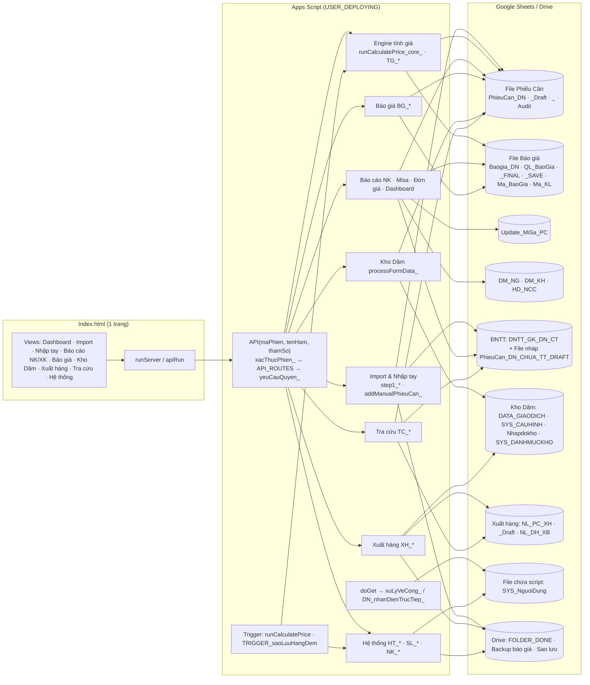
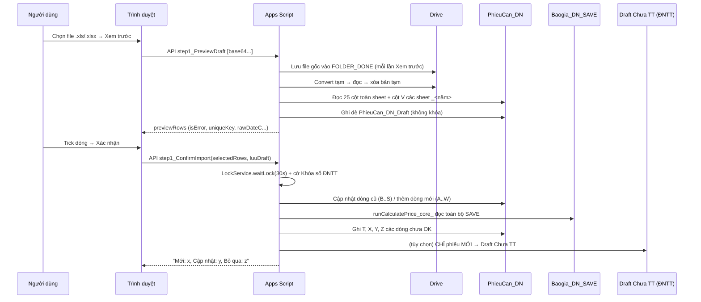

# 13 — Báo cáo kiểm toán Enterprise (28/09/2026)

> **Trạng thái:** báo cáo lập 28/09/2026; một phần đã sửa theo quyết định của chủ hệ thống — xem mục **"Đợt sửa 1"** cuối file.
> Phạm vi: toàn bộ `Code.gs` (6.093 dòng, 199 hàm), `Config.gs` (1.296 dòng, 62 hàm), `Index.html` (5.604 dòng, ~160 hàm JS), `appsscript.json`, commit `099e3a8` trên nhánh `claude/vibrant-thompson-b9llb5`.
> Phương pháp: đọc toàn bộ mã nguồn máy chủ + đọc có chọn lọc giao diện (luồng gọi máy chủ, render, phân quyền, chống bấm lặp, XSS), đối chiếu 12 báo cáo kiểm toán trước (`01`→`12`).
> **Giới hạn trung thực:** không chạy được trên dự án Apps Script thật; bộ test mà các báo cáo trước nhắc tới (`test/`, `tools/`, "553 test") **không có trong repo** nên không chạy lại được. Mọi con số hiệu năng ở mục VI là **ước lượng theo số ô đọc/ghi và độ phức tạp**, không phải đo thực tế.

---

## 0. Tóm tắt điều hành

| Mức | Số lỗi mới phát hiện | Đã biết từ đợt trước, còn mở |
|---|:-:|:-:|
| **Critical** | 0 | 1 (ARCH-01 – trần 10 triệu ô/file) |
| **High** | 6 | 1 (ARCH-02) |
| **Medium** | 16 | 3 (SEC-03, BUG-004, SEC-01) |
| **Low** | 11 | – |

**5 rủi ro cần xử lý trước tiên (đều ảnh hưởng tiền/số liệu):**

1. **H-01 – Tính giá có thể lấy GIÁ CŨ** khi báo giá mới đổi dải khối lượng (mã KL) của cùng một Mã ĐG: dải cũ vẫn "Còn hiệu lực" tới 2050 và được dò trước.
2. **H-02 – Import lại (Cập nhật dòng cũ) không đồng bộ sang Draft Chưa TT của ĐNTT** → ĐNTT có thể lập thanh toán theo khối lượng/đơn giá cũ tới lần làm mới 7:30/13:00.
3. **H-03 – Ngày bắt đầu kỳ vét bãi mới bị khóa nhầm**: không nhập/sửa được phiếu Kho Dăm của đúng ngày chuyển kỳ.
4. **H-04 – Máy chủ tin dữ liệu trình duyệt khi Xác nhận import** (Mã chứng từ, khối lượng) → có thể tạo phiếu trùng (khác 1 dấu cách) hoặc chèn công thức vào ô số.
5. **H-05 – Sửa phiếu Kho Dăm chỉ kiểm tra khóa kỳ theo NGÀY MỚI**, không theo ngày gốc → lời gọi API tự dựng sửa được phiếu thuộc kỳ đã khóa.

**Điểm mạnh đã có (giữ nguyên):** cổng `API()` duy nhất + bảng quyền `API_ROUTES`; vé đăng nhập HMAC dùng 1 lần; `LockService` cho mọi luồng ghi; chống ghi nhầm dòng khi ĐNTT khóa sổ (CONCUR-01/02); đọc lại cột Y trước khi ghi giá (BUG-TG-01); `escapeHtml`/`jsAttr` nhất quán; vẽ bảng lớn theo lô; `sanitize_` ở hầu hết điểm nhập.

---

## I. Phân tích kiến trúc

### I.1 Sơ đồ module



### I.2 Luồng nghiệp vụ chính (Import phiếu cân nhập)



### I.3 Bản đồ dữ liệu (nguồn sự thật)

| Thực thể | Nơi ghi | Khóa | Ai ghi | Ai đọc |
|---|---|---|---|---|
| Phiếu cân nhập | `PhieuCan_DN` (27 cột A..AA) | Cột V `Số/Năm/NK` | Import, Nhập tay, Tính giá, Tra cứu (sửa), **ĐNTT** (AA, Y=OK, xóa dòng khi khóa sổ) | Báo cáo, Dashboard, Kho Dăm (TP), Báo giá (đã áp dụng) |
| Phiếu cân lưu trữ | `PhieuCan_DN_<năm>` | V | **Chỉ ĐNTT** | Báo cáo, kiểm tra trùng, Tra cứu |
| Bảng giá tính tiền | `Baogia_DN_SAVE` (dẫn xuất) | `id_ma` | `BG_lamMoiSave_` | Engine tính giá |
| Báo giá gốc | `Baogia_DN`, `QL_BaoGia` | `ID_BGCT` (8 hex), Số BG | BG_* | BG_coreLogicProcessor_ |
| Misa | `Update_MiSa_PC` (**ảnh chụp**, 1 bản dùng chung) | – | `copyDataWithFinalLookup_` | Báo cáo Misa, tải Excel |
| Kho Dăm | `DATA_GIAODICH` | `NK_/XK_yyyyMMdd_HHmmss_rand` | processFormData_ | Báo cáo tồn kho |
| Xuất hàng | `NL_PC_XH`, `NL_DH_XB` | `Số/Năm/XK`, STT | XH_* | Báo cáo XK, Tra cứu |
| Người dùng | `SYS_NguoiDung` + cache 60s | Email chuẩn hóa | HT_luuDanhSachQuyen_ | xacThucPhien_ mỗi lời gọi |
| Phiên | CacheService `phien_<64hex>` | mã phiên | taoPhien_ | xacThucPhien_ |

### I.4 Luồng trạng thái phiếu cân nhập (cột Y)

`""` (mới ghi) → `Test giá` / `Lỗi ĐK/Báo giá` (engine tính giá, tính lại mỗi lần import/nhập tay/trigger) → `OK` (**chỉ ĐNTT** ghi khi đóng thanh toán; từ đây webapp không đụng tới) → chuyển sang `PhieuCan_DN_<năm>` khi ĐNTT khóa sổ năm.

### I.5 Đồ thị gọi hàm chính (rút gọn)

- `API` → `xacThucPhien_` → `timNguoiDungTheoEmail_` → `DS_QUYEN_` → (cache | `SYS_NguoiDung`)
- `step1_ConfirmImport_` → `KS_thongBaoDNTTDangKhoaSo_`, `LT_bosungMaChungTuDaLuuTru_`, `ghiCapNhatPhieuCanGop_` → `PC_kiemTraDongConDung_`; `runCalculatePrice_core_` → `TG_docBaoGia_`, `TG_tinhGiaDong_`, `docCacDong_`, `ghiNhieuVung_`; `ghiVaoDraftChuaTT_`; `logAudit_`
- `BG_createQuote_ / BG_updateBaogiaRow_ / BG_deleteBaogiaRow_ / BG_deleteQuote_` → `BG_kiemTraSuaXoaNhieuNhom_` → `BG_coreLogicProcessor_`, `BG_getPhieuCanByMaDG_` → `BG_lamMoiSaveSauGhi_` → `BG_lamMoiSave_`
- `processFormData_` (khóa) → `xuLySuaXoaGiaoDich_` → `taiDanhSachKyVetBaiCache_`, `kiemTraKhoaKyVetBaiPure_`, `xuLyNhapSanPhamSanXuat_` (đọc **toàn bộ** PhieuCan_DN), `xuLyXacDinhDoKho_`
- `TC_suaPhieuNhap_ / TC_tinhLaiGia*` → `TC_chayCoKhoa_` → `runCalculatePrice_core_(chonDong)` → `TC_dongBoDraftChuaTT_`

### I.6 Trigger & sự kiện
- `TRIGGER_saoLuuHangDem` (1–2 giờ sáng), `runCalculatePrice` (theo giờ, nếu cài). Cả hai xác thực `triggerUid`.
- Giao diện: 1 listener/nút, bảng lớn dùng 1 listener ủy quyền; sự kiện `storage` để nhận phiên từ cửa sổ đăng nhập; `setInterval` 1,5 s dò phiên khi đang chờ đăng nhập (được dừng đúng lúc).

---

## II. Rà soát kiến trúc

| Tiêu chí | Đánh giá | Bằng chứng |
|---|---|---|
| Module hóa / SoC | Trung bình | Tiền tố module nhất quán (`BG_`, `XH_`, `TC_`, `KD_`…), nhưng 1 file nghiệp vụ 6.093 dòng, 1 file giao diện 5.604 dòng; ~250 thuộc tính `style=""` nội tuyến. |
| SRP | Yếu ở Import | `step1_PreviewDraft_` (200 dòng) = lưu Drive + convert + chuẩn hóa + đối soát + ghi Draft. `xuLySuaXoaGiaoDich_` (137 dòng) = khóa kỳ + quét phiếu cân + độ khô + chống trùng + ghi. |
| DRY | Yếu | **5 bộ phân tích ngày khác quy tắc**: `parseDate_`, `toDateObj_`, `chuanHoaNgay_`, `combineDateTime_`, `NK_ngay_` (năm 2 chữ số: 1 hàm đổi thành 20xx, hàm khác thành 19xx). Khối `LockService … waitLock … "Hệ thống đang bận"` lặp ~20 lần. Bộ lọc báo cáo lặp nguyên văn giữa `getBaoCaoTongHop_` và `getBaoCaoDonGia_`. 2 luồng Import (NK/XK) cùng khung. 8 hàm export cùng khuôn. |
| Magic number/string | Nhiều | `row[21]`, `getRange(r,22)`, `< 70` (Tấn→Kg), `0.45`, `0.0315`, `730` ngày, `"Test giá"`, `"OK"`, `"Đã hủy"`, `"Không có"`. |
| Hardcode | Có | `QUAN_TRI_CO_DINH` (2 Gmail), ID Sheet/Folder mặc định trong `Config.gs` (có cơ chế ghi đè – tốt). |
| Global state | Chấp nhận được | `PHIEN_HIEN_TAI_`, `ND_CACHE_DOC_SAN_`, `_API_ROUTES_CACHE_` sống trong 1 lượt thực thi. |
| Quy ước trả về | Không đồng nhất | Kho Dăm trả **chuỗi** có emoji, phần còn lại trả `{status,message}`; UI Kho Dăm dùng `alert()`, phần khác dùng toast. |
| Dependency Injection / test seam | Không có | Hàm gọi thẳng `SpreadsheetApp.openById` ở ~60 chỗ → khó test đơn vị. |
| Kiểm thử | **Thiếu trong repo** | Báo cáo 07 nêu 20 bộ/553 test + `tools/audit.js`, nhưng repo không có `test/`, `tools/`, `package.json`. Không tái lập được. |

**Chỉ số tổng quan (thang 10):** Bảo trì 5 · Mở rộng 5 · Độ phức tạp cao (≥10 hàm CC > 40) · Technical debt: cao (ngày tháng, chỉ số cột, file đơn khối) · Rủi ro vận hành: trung bình (khóa + CONCUR tốt; điểm yếu nằm ở đồng bộ ĐNTT/Misa và kiểm tra phía máy chủ).

---

## III → IX. Danh sách lỗi chi tiết

Mỗi mục: **Mức · Vị trí · Nguyên nhân · Ảnh hưởng · Giải pháp · Code cần sửa → Code mới · Lợi ích**. Code mới là **đề xuất** (chưa áp dụng), viết theo hướng tương thích ngược.

### High

#### H-01 · Engine tính giá có thể áp giá CŨ khi đổi dải khối lượng
- **Vị trí:** `Code.gs:3048-3053` (nhóm theo `ma + MIN + MAX`), `Code.gs:1157` (lấy dòng khớp đầu tiên), `Code.gs:2397` (`BG_addMaKL_` không kiểm tra chồng dải).
- **Nguyên nhân:** hiệu lực được "nối tiếp" theo nhóm `Mã ĐG + dải KL`. Báo giá mới cho mã X với dải `0_45` **không kết thúc** báo giá cũ của mã X dải `0_50` → dòng cũ còn hiệu lực tới 31/12/2050. `TG_tinhGiaDong_` duyệt danh sách theo thứ tự `Baogia_DN` và dừng ở dòng khớp đầu tiên → phiếu 40 tấn khớp cả 2, **dòng cũ nằm trước nên thắng**.
- **Tình huống:** 01/2026 lập X `0_50` = 1.000.000đ; 09/2026 lập X `0_45` = 1.100.000đ + `45_999` = 1.150.000đ. Phiếu 20/09, 40 tấn → tính 1.000.000đ (sai), bảng "Còn hiệu lực" hiện cả 2 dòng.
- **Ảnh hưởng:** sai tiền thanh toán, khó phát hiện (trạng thái vẫn "Test giá").
- **Giải pháp (không đổi dữ liệu cũ):** (1) Khi lưu báo giá: cảnh báo/chặn nếu cùng Mã ĐG còn dải KL khác **chồng lấn** đang hiệu lực; (2) `BG_addMaKL_` chặn dải chồng lấn; (3) engine: khi nhiều dòng cùng khớp, ưu tiên dòng có **ngày hiệu lực muộn nhất** (đúng ý nghĩa "báo giá mới thay báo giá cũ").
- **Code cần sửa → mới (`TG_tinhGiaDong_`):**
  ```js
  // cũ: for (const bg of listCungMa) { if (khớp) { giaFound = bg.price; break; } }
  // mới: chọn dòng khớp có start lớn nhất (báo giá mới nhất thắng)
  let tot = null;
  for (const bg of listCungMa) {
    if (_tsTrongKhoangHieuLuc_(ts, bg.start, bg.end) && klSoSanh > bg.minKl && klSoSanh <= bg.maxKl
        && (!tot || bg.start > tot.start)) tot = bg;
  }
  giaFound = tot ? tot.price : 0;
  ```
  ⚠️ Thay đổi kết quả tính cho phiếu **chưa OK** đang rơi vào trường hợp chồng dải → cần chạy báo cáo đối chiếu trước (xem XII) và **bạn duyệt nghiệp vụ**.
- **Lợi ích:** loại bỏ sai giá âm thầm.

#### H-02 · Import lại không đồng bộ Draft Chưa TT của ĐNTT
- **Vị trí:** `Code.gs:705` (`traKetQua` chỉ bật khi tick ô), `Code.gs:716-724` (chỉ `batchNew`).
- **Nguyên nhân:** nhánh "Cập nhật dòng cũ" đổi Ngày/Giờ/KL/Đại lý/Nguồn gốc và giá được tính lại, nhưng chỉ phiếu **mới** được ghi sang `PhieuCan_DN_CHUA_TT_DRAFT`. Tra cứu (`TC_*`) thì có `TC_dongBoDraftChuaTT_`, còn Import và Nhập tay (`addManualPhieuCan_`, `Code.gs:834`) thì không.
- **Ảnh hưởng:** ĐNTT chọn phiếu thanh toán theo KL/đơn giá cũ cho tới lần làm mới 7:30/13:00 → rủi ro chi sai.
- **Giải pháp:** sau khi tính giá trong import, luôn gọi `TC_dongBoDraftChuaTT_` (chỉ CẬP NHẬT dòng đã có trong Draft, không thêm mới) — hàm đã có, đã kiểm tra chống lệch dòng.
- **Code mới (`step1_ConfirmImport_`):**
  ```js
  priceResult = runCalculatePrice_core_(undefined, true);        // luôn lấy ketQua
  // ... sau khối ghi Draft phiếu mới:
  TC_dongBoDraftChuaTT_(dataSheet, priceResult && priceResult.ketQua); // cập nhật phiếu đã có trong Draft
  ```
- **Lợi ích:** ĐNTT luôn thấy đúng số liệu ngay sau import.

#### H-03 · Ngày chuyển kỳ vét bãi bị khóa nhầm
- **Vị trí:** `Code.gs:3252-3253`, `3263`, `3267-3272`, `4066`.
- **Nguyên nhân:** kỳ cũ được đóng "Đến: <ngày giờ bắt đầu kỳ mới>", khi đọc lại làm tròn `den` lên 23:59:59 và `tu` của kỳ mới xuống 00:00 → **ngày chuyển kỳ thuộc cả 2 kỳ**. `kiemTraKhoaKyVetBaiPure_` duyệt từ kỳ cũ nhất, gặp kỳ cũ (đã khóa) trước → trả "khóa".
- **Ảnh hưởng:** không thêm/sửa được phiếu Kho Dăm, độ khô của đúng ngày bắt đầu kỳ mới ("❌ Khóa bảo mật: Phiếu thuộc kỳ cũ!").
- **Giải pháp:** duyệt từ kỳ mới nhất (khớp cách `layThongSoVaTieuHaoCache_` đang chọn kỳ mới nhất).
- **Code mới:**
  ```js
  function kiemTraKhoaKyVetBaiPure_(ngayTime, arrKyCache) {
    var t = new Date(ngayTime).setHours(0,0,0,0);
    for (var i = arrKyCache.length - 1; i >= 0; i--) {           // kỳ mới nhất trước
      if (t >= arrKyCache[i].tu && t <= arrKyCache[i].den) return arrKyCache[i].isLocked;
    }
    return false;
  }
  ```
- **Lợi ích:** hết chặn nhầm; không đổi dữ liệu.

#### H-04 · Xác nhận import tin dữ liệu trình duyệt
- **Vị trí:** `Code.gs:573` (`item.isError`), `579` (`uniqueKey` không trim/không tính lại), `645`, `663` (KL ghi thẳng, không ép số), `665`.
- **Nguyên nhân:** `step1_ConfirmImport_` dùng lại nguyên `uniqueKey`, `klCan1/2`, `klHangGoc`, `isError` từ trình duyệt. `duplicateMap` dùng khóa đã `trim()`.
- **Ảnh hưởng (cần tài khoản Nhân viên + lời gọi tự dựng):** `"7107/2026/NK "` (thêm dấu cách) → không thấy trùng → **phiếu trùng** chen vào sổ; `klHangGoc: "=IMPORTXML(...)"` → **công thức sống** trong PhieuCan_DN; `rawDateC` rác → `Invalid Date` làm hỏng cả lô.
- **Giải pháp:** máy chủ tự tính lại khóa từ `soPhieu` + năm `rawDateC`, bắt buộc ngày hợp lệ, ép số hữu hạn ≥ 0.
- **Code mới:**
  ```js
  const soHuuHan_ = v => { const n = Number(v); return isFinite(n) && n >= 0 ? n : null; };
  // trong vòng lặp:
  const dateC = item.rawDateC ? new Date(item.rawDateC) : null;
  const dateD = item.rawDateD ? new Date(item.rawDateD) : null;
  if (!dateC || isNaN(dateC) || !dateD || isNaN(dateD)) { countSkip++; continue; }
  const uniqueKeyMaCT = String(item.soPhieu || "").trim() + "/" + dateC.getFullYear() + "/NK";
  const kl1 = soHuuHan_(item.klCan1), kl2 = soHuuHan_(item.klCan2), klH = soHuuHan_(item.klHangGoc);
  if (klH === null || klH === 0) { countSkip++; continue; }
  ```
- **Lợi ích:** chặn phiếu trùng và công thức độc; không đổi kết quả với dữ liệu hợp lệ.

#### H-05 · Sửa phiếu Kho Dăm: kiểm tra khóa kỳ theo ngày MỚI, bỏ qua ngày GỐC
- **Vị trí:** `Code.gs:3645-3647`.
- **Nguyên nhân:** `ngayCheck = dataEdit.ngay || ngàyGốc` → khi sửa, chỉ ngày người dùng gửi lên được kiểm tra.
- **Ảnh hưởng:** giao diện ẩn nút Sửa với phiếu kỳ đã khóa, nhưng lời gọi API tự dựng (`hanhDong:"SUA"`, `ngay` thuộc kỳ mở) sửa/"kéo" được phiếu của kỳ đã chốt → tồn kho kỳ cũ thay đổi.
- **Code mới:**
  ```js
  if (rowIdx > -1 && kiemTraKhoaKyVetBaiPure_(data[rowIdx - 1][1], arrKyCache))
    return "❌ Khóa bảo mật: Phiếu gốc thuộc kỳ đã khóa!";
  if (kiemTraKhoaKyVetBaiPure_(ngayCheck, arrKyCache)) return "❌ Khóa bảo mật: Phiếu thuộc kỳ cũ!";
  ```
- **Lợi ích:** khóa kỳ được bảo vệ ở máy chủ (defense-in-depth).

#### H-06 · Báo cáo Misa dùng 1 ảnh chụp chung + nhận dòng không có ngày
- **Vị trí:** `Code.gs:1045` (`if (ngayPhieu && …) continue;`), `Code.gs:1062` (xóa + ghi đè 1 sheet dùng chung), `Code.gs:1719`, `988`.
- **Nguyên nhân:** (a) dòng có Ngày cân 1 rỗng/không đọc được **không bị loại** → xuất hiện trong MỌI kỳ Misa; (b) `Update_MiSa_PC` là 1 sheet cho mọi người: A tạo tháng 8, B tạo tháng 9 ngay sau, A bấm tải Excel → nhận dữ liệu tháng 9; sheet không lưu "khoảng ngày / người tạo / lúc tạo".
- **Ảnh hưởng:** hạch toán trùng/sai kỳ vào MISA.
- **Giải pháp:** loại dòng không có ngày hợp lệ; ghi siêu dữ liệu (khoảng ngày, người, thời điểm) vào 1 ô/Developer Metadata và hiển thị + kiểm tra trước khi tải; tùy chọn: trả Excel trực tiếp theo khoảng ngày thay vì qua sheet chung.
- **Code mới:** `if (!ngayPhieu || ngayPhieu < start || ngayPhieu > end) continue;` + `ssTarget.getParent().addDeveloperMetadata("MISA_SNAPSHOT", JSON.stringify({tu, den, email, luc}))`.

### Medium

| ID | Tên lỗi | Vị trí | Nguyên nhân → Ảnh hưởng | Giải pháp đề xuất |
|---|---|---|---|---|
| M-01 | File tạm xuất Excel/PDF không bao giờ xóa | `Code.gs:1791-1806`, `996`, `1943`, `2258`, `3138` | Mỗi lần xuất/in phiếu tạo 1 Spreadsheet vĩnh viễn trong `FOLDER_DONE` (hàng nghìn file/năm) → Drive rối, tốn quota, lẫn với file gốc import. | Trong `chuyenLinkXuatThanhFile_` (Config.gs:1089) sau khi tải thành công: `DriveApp.getFileById(id).setTrashed(true)`; + trigger dọn file `BaoCao_*`/`PhieuNhapKho_*` > 7 ngày. |
| M-02 | Mỗi lần "Xem trước" lưu thêm 1 bản file gốc | `Code.gs:166`, `4628` | Xem trước 3 lần = 3 bản giống nhau trong Done; lưu cả khi người dùng hủy. | Lưu file gốc ở bước Xác nhận, hoặc đặt tên theo MD5 nội dung (`Utilities.computeDigest`) và bỏ qua nếu đã có. |
| M-03 | `toDateObj_` đọc năm 2 chữ số thành 19xx | `Code.gs:2108` | `"25/07/26 08:00"` → năm **1926** (trong khi `chuanHoaNgay_` hiểu 2026) → Mã CT `…/1926/NK`, báo cáo lệch. | `if (y < 100) y += 2000;` + gom 5 hàm ngày về 1 thư viện `NGAY_*`. |
| M-04 | Múi giờ của file convert tạm chưa được ép | `Code.gs:170-172` | Nếu ô Excel là datetime thật, giá trị đọc theo múi giờ mặc định tài khoản Admin; khác `Asia/Ho_Chi_Minh` → lệch giờ/ngày, lệch năm quanh 31/12. **Cần xác minh trên tài khoản thật.** | `SpreadsheetApp.openById(tempFile.id).setSpreadsheetTimeZone(Session.getScriptTimeZone())` trước khi đọc. |
| M-05 | Xuất hàng: `tuNgay/denNgay` không sanitize | `Code.gs:4931`, `5042` | Chuỗi `"=HYPERLINK(...)"` thành công thức trong `NL_DH_XB`. | Chỉ nhận `yyyy-MM-dd` (regex) rồi ghi Date; hoặc `sanitize_`. |
| M-06 | In phiếu PDF: chuỗi đã lưu thành công thức lại | `Code.gs:1970-1980` | Ô lưu `'=abc` đọc ra `=abc`, `setValue` vào file tạm → thành công thức. | Bọc `chongCongThuc_()` cho mọi `setValue` chuỗi. |
| M-07 | Xóa Mã báo giá / Mã KL không kiểm tra đang dùng | `Code.gs:2358`, `2430` | Xóa mã đang có trong `Baogia_DN`/phiếu cân → báo cáo "Không tìm thấy trong danh mục", mất diễn giải. | Chặn nếu còn dòng `Baogia_DN` hoặc phiếu cân chưa OK dùng mã; hoặc xóa mềm (cột Trạng thái). |
| M-08 | Thao tác tạo mới không idempotent | `BG_createQuote_:2899`, `XH_saveDonHang_:4878`, Kho Dăm `3750` | Mất mạng sau khi máy chủ đã ghi → người dùng bấm lại → **báo giá/đơn hàng/phiếu kho trùng**. Overlay chặn chuột nhưng phím Enter vẫn kích hoạt nút đang focus. | Trình duyệt sinh `requestId` (UUID) cho mỗi lần bấm; máy chủ lưu `CacheService` 10 phút, gặp lại thì trả kết quả cũ. Vô hiệu nút khi đang gửi. |
| M-09 | Báo cáo Kỳ vét bãi giữ khóa toàn hệ thống | `Index.html:3980` → `processFormData_` `Code.gs:4461` | Báo cáo chỉ đọc nhưng chạy trong Script Lock → mọi import/tính giá/báo giá phải chờ. | Gọi thẳng route XEM `layBaoCaoTonKho`/thêm route `layBaoCaoTheoKyVetBai` (X) không khóa. |
| M-10 | "Nhập TP dăm" quét toàn bộ PhieuCan_DN + `Utilities.formatDate` mỗi dòng | `Code.gs:3455-3471` | 50.000 dòng × 27 cột đọc + 50.000 lượt `formatDate`, **trong lúc giữ khóa**. | Đọc 2 cột B, J; so ngày bằng số học (`dinhDangGMT7_` hoặc so mốc ms). |
| M-11 | Nhật ký `Audit` tăng vô hạn trong file Phiếu Cân | `Code.gs:2126-2149` | Chung trần 10 triệu ô với `PhieuCan_DN` (ARCH-01); mỗi `logAudit_` mở lại Spreadsheet. | Ghi Audit sang file riêng (Liên kết dữ liệu) + xoay vòng theo năm; cache `ss` trong lượt. |
| M-12 | Sheet xem trước dùng chung, không khóa | `Code.gs:293-308`, `4727-4741` | 2 người Xem trước cùng lúc → `PhieuCan_DN_Draft` lẫn dữ liệu 2 lô (chỉ ảnh hưởng hiển thị trên sheet). | Ghi Draft kèm cột email/phiên, hoặc bỏ ghi sheet (bảng xem trước đã có trên web). |
| M-13 | Bảng xem trước import vẽ toàn bộ dòng | `Index.html:2496-2521` | 10.000–50.000 dòng → DOM lớn, treo tab (khác 5 báo cáo đã vẽ theo lô). | Dùng `veBangTheoLo` như PERF-08. |
| M-14 | Chia sẻ Drive gọi `getFileById` trong vòng lặp lồng | `Config.gs:461-473` | 10 tài nguyên × 50 người = 500 lần lấy file → chậm, dễ chạm quota Drive. | Lấy `resource` 1 lần/tài nguyên (đưa ra ngoài vòng người dùng). |
| M-15 | Xuất hàng: số Cân lần 1/2 không theo Locale, không quy Tấn→Kg | `Code.gs:4691-4692` | `"27.020"` (VN) → 27,02; NK dùng `parseSoTheoLocale_` + quy tắc `<70`, XK thì không → số liệu 2 luồng lệch quy ước. | Dùng `parseSoTheoLocale_`; thống nhất quy tắc Tấn/Kg (cần bạn xác nhận). |
| M-16 | Phiếu nhập tay không vào Draft Chưa TT | `Code.gs:834` | Phiếu nhập tay chỉ xuất hiện bên ĐNTT sau lần làm mới 7:30/13:00. | Thêm ô tùy chọn như Import, dùng lại `ghiVaoDraftChuaTT_`. |

### Low

| ID | Tên lỗi | Vị trí | Giải pháp |
|---|---|---|---|
| L-01 | Xuất hàng lưu Ngày giờ cân dạng **chuỗi**, Nhập kho lưu **Date** | `Code.gs:4791-4792` | Giữ tương thích; thêm cột ẩn timestamp số để lọc/sắp xếp. |
| L-02 | `xuLySuaXoaDoKho_` XOA không thấy dòng → trả `undefined`, log "OK" | `Code.gs:4147-4151` | `return "❌ Không tìm thấy độ khô ngày " + target;` |
| L-03 | Thêm kho không kiểm tra trùng tên | `Code.gs:4005-4008` | Chặn trùng `tenKho` (không phân biệt hoa thường). |
| L-04 | Lưu danh sách người dùng không khóa | `Config.gs:1247` | Bọc `LockService` (2 Admin lưu cùng lúc mất thay đổi). |
| L-05 | Nonce vé Cổng kiểm tra rồi mới ghi (không nguyên tử) | `Config.gs:1173-1174` | Bọc Script Lock ngắn (1–2 s) quanh get/put nonce. |
| L-06 | `Folder.addFile/removeFile` đã deprecated | `Code.gs:1004,1803,2017,2269,3158` | `DriveApp.getFileById(id).moveTo(folder)`. |
| L-07 | Sắp xếp Mã CT theo chuỗi (`"10/…" < "9/…"`) | `Code.gs:1461,1687,1774` | So `localeCompare(…, {numeric:true})`. |
| L-08 | Báo giá: không chặn nhóm trùng (cùng mã + KL + hiệu lực) trong 1 phiếu | `Code.gs:2907` | Kiểm tra trùng trước khi ghi; ID_BGCT 8 hex không kiểm tra va chạm. |
| L-09 | Thông báo lỗi/thành công Kho Dăm dùng `alert()` (11 chỗ), phần khác dùng toast | `Index.html:4081-4753` | Chuẩn hóa về `toast`/dialog chung. |
| L-10 | Kho Dăm "Hoàn thành đơn hàng" đọc `DATA_GIAODICH` 2 lần | `Code.gs:3844-3851` | Gộp `timKhoNguonTCLonNhat_` vào `tongHopSoLieuKhoXuatBan_`. |
| L-11 | `xoaCacDong_` dùng `indexOf` trong `filter` (O(n²)) | `Code.gs:870` | Dùng `Set`. |

### Đã biết từ đợt trước, vẫn mở (giữ nguyên đánh giá)
ARCH-01 (Critical với mục tiêu 500.000 dòng), ARCH-02 (High – báo cáo không lọc ngày trả toàn lịch sử), SEC-03 (Chỉ xem gọi `BG_updateHieuLuc/BG_showAllData` chiếm khóa + ghi sheet dẫn xuất), BUG-004 (2 người sửa cùng phiếu Kho Dăm – lost update), SEC-01 (`ALLOWALL` cho Portal).

---

## IV. Đồng bộ dữ liệu

| Cặp dữ liệu | Hiện trạng | Mất / sai / trùng / lệch | Mục lỗi |
|---|---|---|---|
| Import → Draft xem trước | Ghi đè sheet chung, không khóa | Lẫn lô khi 2 người | M-12 |
| Import → PhieuCan_DN | Khóa + CONCUR | Trùng khi khóa do trình duyệt gửi khác 1 dấu cách | H-04 |
| PhieuCan_DN → Draft Chưa TT (ĐNTT) | Chỉ phiếu mới khi import; Tra cứu có đồng bộ | **Lệch** KL/giá sau import lại, nhập tay | H-02, M-16 |
| Báo giá gốc → SAVE (engine) | Làm mới trong cùng khóa (BUG-BG-01 đã sửa) | Giá cũ thắng khi đổi dải KL | H-01 |
| Báo giá → phiếu cân đã tính | Không tự tính lại khi lưu báo giá | Phiếu "Lỗi ĐK/Báo giá" chờ lần import/trigger kế tiếp | Đề xuất X |
| SAVE ↔ FINAL | FINAL chỉ dựng lại khi xem tab Hiệu lực | Xuất "FINAL" có thể dùng bản cũ nếu chưa mở tab | Low |
| PhieuCan_DN → Update_MiSa_PC | Ảnh chụp thủ công, 1 sheet chung | Sai kỳ, dòng không ngày lặp mọi kỳ | H-06 |
| ĐNTT ↔ webapp (khóa sổ) | Cờ Developer Metadata + kiểm tra dòng đích | Tốt | – |
| Kho Dăm ↔ Phiếu cân (TP) | Đọc trực tiếp PhieuCan_DN theo ngày | Không gồm sheet lưu trữ (đúng vì cùng năm) | – |
| Dashboard / Báo cáo / Tra cứu | Đọc trực tiếp, không cache dữ liệu giao dịch | Đúng thời điểm | – |
| Người dùng (sheet ↔ cache 60 s) | Sửa trên web xóa cache ngay | Sửa thẳng sheet: tối đa 60 s | Chấp nhận |
| Audit | `appendRow` nguyên tử | Không mất; không giới hạn dung lượng | M-11 |
| Rollback | Không có giao dịch nhiều sheet | Import: ghi PhieuCan xong, lỗi ở bước tính giá/Draft → dữ liệu đã ghi không quay lui (có log) | Đề xuất X (hàng đợi + đánh dấu lô) |

---

## V. Trùng lặp

| Loại | Vị trí | Nguyên nhân | Mức | Giải pháp |
|---|---|---|---|---|
| Duplicate Record (phiếu cân) | `step1_ConfirmImport_` | Khóa từ trình duyệt | High | H-04 |
| Duplicate Transaction (báo giá, đơn hàng, phiếu kho) | M-08 | Không idempotent | Medium | `requestId` |
| Duplicate File / Upload | Done: mỗi Xem trước + mỗi export | M-01, M-02 | Medium | Hash + dọn file tạm |
| Duplicate Business Logic (giá) | 2 dòng báo giá cùng khớp | H-01 | High | Ưu tiên báo giá mới nhất |
| Duplicate Validation / Parse ngày | 5 hàm | Lịch sử vá từng chỗ | Medium | Thư viện ngày duy nhất |
| Duplicate Function / Code | 2 luồng Import, 8 export, 2 bộ lọc báo cáo, ~20 khối khóa | Sao chép | Medium | `voiKhoa_(fn)`, `taoFileXuat_(cauHinh)`, `locPhieuCan_(filters)` |
| Duplicate Lookup | `TC_timPhieuNhap_` vs `exportPhieuCanPDF_` (tìm phiếu theo Mã CT) | 2 cách | Low | Dùng chung `TC_timPhieuNhap_` |
| Duplicate ID | ID_BGCT 8 hex, `KHO_<ms>`, `NK_…_rand4` | Không kiểm va chạm | Low | Kiểm tra tồn tại trước khi ghi |
| Duplicate Document Number | Số BG `yyyyMMdd-NNN`, STT đơn hàng | Sinh trong khóa – an toàn | – | – |
| Duplicate Sheet | `PhieuCan_DN_Draft`, `NL_PC_XH_Draft` dùng chung | Thiết kế | Low | M-12 |
| Duplicate Trigger | `HT_luuCauHinhSaoLuu_` xóa rồi tạo lại | An toàn | – | – |
| Duplicate google.script.run / Listener | 1 wrapper `runServer`; listener ủy quyền | Tốt | – | – |
| Duplicate CSS | Bộ class `#view-khodam .*` song song bộ chung; ~250 `style=""` | Sáp nhập module cũ | Low | Gộp token CSS |

---

## VI. Hiệu năng (ước lượng)

Giả định Sheets đọc ~150–300 nghìn ô/giây, mỗi lệnh gọi dịch vụ ~50–300 ms. `N` = số dòng `PhieuCan_DN` đang theo dõi.

| Luồng | Đọc/ghi mỗi lần | N = 1.000 | 10.000 | 50.000 | Ghi chú |
|---|---|---|---|---|---|
| Xem trước import | 25·N ô + convert Drive | ~3–6 s | ~5–8 s | ~10–15 s | Convert Drive chiếm phần lớn |
| Xác nhận import + tính giá | (25+26)·N ô + SAVE | ~2–4 s | ~5–8 s | ~15–30 s (trong khóa) | Người khác thấy "đang bận" nếu > 30 s |
| Nhập tay 1 phiếu | 1·N + 26·N ô | ~1–2 s | ~3–4 s | ~8–12 s | Tính giá lại mọi phiếu chưa OK |
| Nhập TP dăm (M-10) | 27·N ô + N lượt `formatDate` | ~2 s | ~10 s | **~40–60 s** (trong khóa) | Nguy cơ cao nhất |
| Báo cáo không lọc ngày | 27·(N+lưu trữ) ô | nhanh | vài giây | ARCH-02 | Nguy cơ vượt 6 phút ở quy mô lớn |
| Tra cứu | 27·N ô | nhanh | ~2 s | ~6–8 s | Đã tối ưu PERF-TC |
| Xem trước 50.000 dòng trên trình duyệt | DOM toàn bộ | ổn | chậm | **treo tab** | M-13 |

**Độ phức tạp đáng chú ý:** hầu hết O(N); O(n·m): `BG_exportFileSmart_` (`filteredIds.includes`), chia sẻ Drive (M-14); O(n²): `xoaCacDong_` (L-11). Không thấy O(n³).
**Đề xuất:** cột chỉ mục (Mã CT → dòng) cache theo `getLastRow`; đọc đúng cột cần; `Set/Map` thay `includes/indexOf`; debounce ô lọc; hàng đợi (queue) cho tính giá hàng loạt; phân trang máy chủ cho báo cáo (ARCH-02).

---

## VII–VIII. Giao diện & trải nghiệm

| Hạng mục | Hiện trạng | Đề xuất |
|---|---|---|
| Responsive | 3 media query ở 820 px; sidebar chuyển thành hàng ngang; bảng cuộn ngang | Thêm mốc 480 px; bảng dạng thẻ trên điện thoại cho Tra cứu/Kho Dăm |
| Dark mode | Không có (token `:root` sẵn, dễ thêm) | `@media (prefers-color-scheme: dark)` đổi token |
| Zoom 125–200% | Sidebar `position:sticky;height:100vh` — nội dung menu dài bị cắt ở 200% | `overflow-y:auto` cho sidebar |
| Sticky header | Có (`th` sticky, dòng tổng sticky) | – |
| Accessibility | 144 `<label>`, **0** có `for=`; 2 `aria-*`; nhiều nút chỉ emoji | Gắn `for`/`aria-label`; vòng focus trong modal; `role="status"` cho toast |
| Thông báo | Toast (đa số) + `alert()` (Kho Dăm) + `confirm()` (20 chỗ) | 1 hệ dialog thống nhất |
| Loading | Overlay toàn màn hình; chưa có skeleton | Skeleton cho Dashboard/báo cáo |
| Chống bấm lặp | Overlay; Enter vẫn kích hoạt nút | Vô hiệu nút + `requestId` (M-08) |
| Thao tác rườm rà | Import: Xem trước → tick → Xác nhận là hợp lý; Báo giá xong phải chờ import/trigger mới cập nhật giá phiếu "Lỗi ĐK/Báo giá" | Sau khi lưu báo giá: gợi ý "Tính lại N phiếu đang Lỗi ĐK/Báo giá khớp mã này" |
| Thông minh hơn | – | Cảnh báo `|Cân1 − Cân2| ≠ KL Hàng`; cảnh báo Ngày cân 2 < Ngày cân 1 (hiện không kiểm tra ở cả Import lẫn Nhập tay) |

---

## IX. Bảo mật

| Hạng mục | Kết quả | Ghi chú |
|---|---|---|
| Authentication | ✅ | HMAC vé 5 phút, nonce 1 lần (L-05 race nhỏ), phiên 12 h/trượt 6 h |
| Authorization | ✅ | `API_ROUTES` + 4 mức quyền; hàm nghiệp vụ kết thúc `_` |
| Server-side validation | ⚠️ | H-04, H-05, M-05 — máy chủ còn tin trình duyệt ở vài luồng ghi |
| XSS / HTML Injection | ✅ | `escapeHtml`/`jsAttr`; nội suy `${}` còn lại là giá trị nội bộ |
| Formula/CSV Injection | ⚠️ | Còn H-04 (ô số), M-05, M-06 |
| CSRF | ✅ không áp dụng | Cần mã phiên |
| Clickjacking | ⚠️ SEC-01 | `ALLOWALL` cho Portal |
| Token | ⚠️ Low | Mã phiên trong `localStorage` |
| Spreadsheet/Folder ID | ✅ | Chỉ Quản trị xem/sửa Liên kết dữ liệu |
| Drive access | ⚠️ Low | `HT_thuHoiQuyenTaiNguyen_` nhận `id` tùy ý (chỉ Quản trị) — nên giới hạn trong danh sách tài nguyên |
| Scope OAuth | ⚠️ | `drive` toàn quyền (cần cho convert/sao lưu); `access: ANYONE` — chấp nhận vì có cổng |
| Hardcode email | ⚠️ | `QUAN_TRI_CO_DINH` trong mã nguồn |
| Log/Audit | ✅ | Ghi email người thực hiện; cắt 45.000 ký tự; chống công thức. Thiếu xoay vòng (M-11) |

---

## X. Đề xuất nâng cấp (Enterprise / Commercial)

| Ưu tiên | Hạng mục | Giá trị | Ghi chú kỹ thuật |
|---|---|---|---|
| 1 | **Idempotency + hàng đợi ghi** | Hết trùng khi mất mạng/bấm lặp | `requestId` + CacheService; `Queue` sheet cho tính giá hàng loạt chạy bằng trigger |
| 1 | **Kiểm thử trong repo + CI** | Tái lập được mọi con số | Đưa `test/` (Jest + giả lập GAS) vào repo, GitHub Actions chạy mỗi PR; `clasp` để deploy |
| 1 | **Version History / Audit chi tiết** | Truy vết sửa phiếu, báo giá | Lưu trước/sau dạng JSON vào Audit (file riêng) |
| 2 | Tự tính lại phiếu "Lỗi ĐK/Báo giá" sau khi lưu báo giá | Bớt thao tác | Gọi `runCalculatePrice_core_(chonDong theo mã)` trong cùng khóa |
| 2 | Import Wizard | Ít lỗi file | Bước ánh xạ cột theo tên (như Xuất hàng), kiểm tra KL, ngày, trùng |
| 2 | Monitoring & Log Viewer | Phát hiện sớm lỗi | Đã có Nhật ký; thêm bảng "Lỗi 24 h", thời gian chạy từng API (Stackdriver đã bật) |
| 2 | Auto Backup có kiểm tra khôi phục | An toàn dữ liệu | Đã có sao lưu đêm; thêm kiểm tra định kỳ mở bản sao + đếm dòng |
| 3 | Conflict Resolution (optimistic lock) | Hết lost update (BUG-004) | Cột "Phiên bản"/timestamp, so trước khi ghi |
| 3 | Offline / PWA / IndexedDB / Service Worker | Giới hạn | HtmlService chạy trong iframe `googleusercontent.com`, **không đăng ký Service Worker được**; chỉ khả thi cache nhẹ bằng IndexedDB cho danh mục + nháp nhập tay (Auto Save/Crash Recovery của form) |
| 3 | Realtime Sync / Notification | Trung bình | Không có WebSocket; dùng poll 30–60 s cho Dashboard hoặc email/Chat webhook khi có lỗi |
| 3 | Undo/Redo | Thấp | Chỉ hợp lý cho form nháp phía trình duyệt; với dữ liệu sổ sách nên dùng "phiếu điều chỉnh" + Version History |
| 4 | Chuyển dữ liệu giao dịch sang BigQuery/Cloud SQL | Vượt ARCH-01 | Khi > 300.000 phiếu hoặc cần nhiều người ghi đồng thời |

---

## XII. Kế hoạch sửa (khi bạn duyệt)

**Nguyên tắc:** không đổi tên hàm công khai, không đổi cấu trúc sheet/cột, không đổi `API(maPhien, tenHam, thamSo)`; mỗi thay đổi có comment `// FIX <ID>`, dòng CHANGELOG, test case, cách quay lui.

| Đợt | Mục | Cần bạn quyết định? | Test case chính | Rollback |
|---|---|---|---|---|
| A (an toàn, không đổi kết quả hợp lệ) | H-02, H-03, H-04, H-05, M-03, M-05, M-06, L-02, L-04, L-07 | Không | Import lại phiếu đã có trong Draft → Draft cập nhật KL/giá; phiếu ngày chuyển kỳ lưu được; khóa `"…/NK "` bị từ chối; `klHangGoc:"=1+1"` bị từ chối; sửa phiếu kỳ khóa qua API bị chặn; `"25/07/26"` → 2026 | Dán lại 3 file của commit `099e3a8` + New version |
| B (đổi hành vi, cần duyệt) | **H-01** (ưu tiên báo giá mới nhất + chặn dải chồng), H-06 (Misa), M-01 (xóa file tạm), M-02, M-07, M-08, M-09, M-15, M-16 | **Có** | Trước khi bật H-01: chạy hàm chỉ-đọc liệt kê phiếu chưa OK có ≥ 2 dòng báo giá khớp → bạn xem danh sách | Như trên; H-01 có cờ `PropertiesService` bật/tắt |
| C (hiệu năng/UI) | M-10, M-11, M-12, M-13, M-14, L-06, L-09…L-11, a11y, dark mode | Không | Đếm lượt gọi Sheets trước/sau; Chromium 50.000 dòng xem trước | Như trên |

---

## XIII. Kiểm tra cuối (kế hoạch — chưa chạy)

Không có môi trường Google thật trong phiên này và bộ test cũ không có trong repo, nên **chưa thể khẳng định** "không còn lỗi Critical/Race/Duplicate". Sau khi sửa, cần:

1. Khôi phục/viết bộ test Jest giả lập GAS **vào repo** (Regression, Race condition với khóa bị giữ, Duplicate, Data integrity, Load 1.000/10.000/50.000 dòng đếm lượt gọi).
2. UI test Playwright (Chromium có sẵn): xem trước 50.000 dòng, 125/150/200 % zoom, 375 px, phím Enter khi đang gửi.
3. Chạy thử trên **bản sao** 4 Spreadsheet (Liên kết dữ liệu trỏ sang bản sao): import 3 file thật, import lại file đã sửa, đối chiếu Draft ĐNTT, tạo báo giá đổi dải KL, chuyển kỳ vét bãi.
4. Theo dõi Executions/Quota 1 tuần sau deploy.

---

## Đợt sửa 1 (28/09/2026) — theo quyết định của chủ hệ thống

Quyết định: (1) chỉ sửa một số lỗi nhỏ; (2) "báo giá mới nhất thắng", lưu báo giá bị chồng dải vẫn cho lưu nhưng có cảnh báo; (3) xóa file tạm; (4) xử lý H-06; (5) Xuất hàng thống nhất đơn vị Kg.

| ID | Đã sửa | Hàm |
|---|---|---|
| H-01 | Engine chọn dòng báo giá khớp có hiệu lực **muộn nhất** (hòa nhau giữ dòng đứng trước như cũ). Lưu/sửa báo giá hoặc thêm Mã KL chồng dải: **vẫn lưu**, thông báo kèm ⚠️ liệt kê cặp dải chồng (toast màu cam, giữ 20 giây, bấm để đóng). | `TG_tinhGiaDong_`, `BG_canhBaoChongDai_` (mới), `BG_lamMoiSaveSauGhi_(thongBao, idsMoi)`, `BG_createQuote_`, `BG_updateBaogiaRow_`, `BG_addMaKL_`, `toast()` |
| H-02 | Import xong luôn cập nhật các phiếu ĐÃ CÓ trong Draft Chưa TT theo KL/ngày/giá mới (chỉ cập nhật, không thêm). | `step1_ConfirmImport_` → `TC_dongBoDraftChuaTT_` |
| H-03 | Ngày chuyển kỳ vét bãi không còn bị khóa nhầm. | `kiemTraKhoaKyVetBaiPure_` |
| H-04 | Xác nhận import tự tính lại Mã CT, bắt buộc ngày hợp lệ, KL là số ≥ 0; dòng sai đếm "Dữ liệu không hợp lệ (bỏ qua)". Mã CT ghi xuống cũng qua `sanitize_`. | `step1_ConfirmImport_` |
| H-05 | Sửa/xóa phiếu Kho Dăm kiểm tra khóa kỳ theo cả ngày gốc. | `xuLySuaXoaGiaoDich_` |
| H-06 | Misa loại dòng không có Ngày cân 1 hợp lệ; lưu thông tin bản (khoảng ngày, số dòng, người, lúc); tải file MISA kiểm tra khoảng ngày đang chọn khớp bản hiện có, tên file kèm khoảng ngày. | `copyDataWithFinalLookup_`, `runCreateMisaData_`, `downloadMisaExcel_(tuNgay, denNgay)`, `MISA_*` (mới), Index `btnDownloadMisaGoc` |
| M-01 | File Google Sheet tạm của chức năng xuất (tên `BaoCao_`, `PhieuNhapKho_`, `Misa_Export_`, `Mau_Import_`, `NhatKy_HoatDong_` trong thư mục Done) vào Thùng rác ngay sau khi tải về thành công; file cũ > 1 ngày được dọn mỗi lượt sao lưu (tối đa 500/lượt). File báo giá xuất (`Bao_Gia_HAK_*`, thư mục lưu báo giá) và file Excel gốc import **không** bị đụng. | `chuyenLinkXuatThanhFile_`, `laFileTamXuat_`, `SL_donFileTamCu_` |
| M-03 | Năm 2 chữ số hiểu là 20xx. | `toDateObj_` |
| M-05 | Đơn hàng xuất bán: NL_Từ/Đến ngày qua `sanitize_`. | `XH_saveDonHang_`, `XH_updateDonHang_` |
| M-06 | In phiếu nhập kho chặn công thức. | `exportPhieuCanPDF_` |
| M-15 | Import Xuất hàng: KL Hàng, Cân lần 1/2 < 70 hiểu là Tấn → quy Kg; Cân lần 1/2 đọc theo Locale. | `XH_step1_PreviewDraft_` |
| L-02 | Xóa độ khô không thấy dòng → báo lỗi rõ. | `xuLySuaXoaDoKho_` |

**Lưu ý nghiệp vụ H-01:** phiếu **chưa OK** đang khớp 2 dải chồng nhau sẽ đổi sang giá của báo giá mới nhất ở lần tính giá kế tiếp (import, nhập tay, trigger, Tính lại giá). Phiếu OK không bị đụng.

**Test case đã chạy (Node + stub Apps Script, múi giờ Asia/Ho_Chi_Minh):** ngày chuyển kỳ → mở; ngày trước đó → khóa; `"25/07/26"` → 2026; phiếu 40 tấn sau báo giá mới → giá mới, trước báo giá mới → giá cũ, 48 tấn → dải 45_999; cảnh báo chồng dải liệt kê đúng 2 cặp, không báo mã khác; nhận diện tên file tạm đúng/sai. Cú pháp 3 file hợp lệ. **Chưa chạy trên Google thật** — cần thử: import lại 1 phiếu đang có trong Draft Chưa TT, tạo báo giá chồng dải, xuất 1 báo cáo Excel (file tạm phải vào Thùng rác), trích xuất + tải Misa với 2 khoảng ngày khác nhau, import 1 file Xuất hàng có cột Tấn.

**Rollback:** dán lại `Code.gs`, `Config.gs`, `Index.html` của commit `099e3a8` → Deploy › Manage deployments › Edit › New version. Không đổi cấu trúc sheet; chỉ thêm Script Property `MISA_BAN_HIEN_TAI_JSON` (vô hại khi quay lui). File tạm đã vào Thùng rác khôi phục được trong 30 ngày.

## Đợt sửa 2 (28/09/2026) — Quy tắc định dạng số / ngày / canh lề

Quy tắc của chủ hệ thống:
1. Chỗ điền số có phân cách hàng nghìn.
2. Số canh phải, chuỗi canh trái, ngày canh giữa.
3. Webapp hiển thị và ghi Google Sheet theo **Locale hệ thống** (Hệ thống › Cấu hình).
4. PDF, kết xuất Excel, kết xuất MISA theo **Locale Misa** riêng.

| Phạm vi | Đã làm | Hàm / vị trí |
|---|---|---|
| Ô nhập số (webapp) | Mọi `<input type="number">` (kể cả ô vẽ bằng JS ở Kho Dăm, Báo giá) tự thành ô chữ canh phải, gõ tới đâu thêm phân cách tới đó theo Locale hệ thống (VN `1.234,5` · US `1,234.5`). VN gõ phím `.` khi chưa có dấu thập phân = dấu `,`. **`.value` vẫn trả số chuẩn** (`"1234.5"`) nên mọi code cũ + máy chủ không đổi. Số lẻ tối đa theo `step` (0.01→2, 0.0001→4), không có `step`→3. | `Index.html`: `nangCapOSo`, `soChuanTuHienThi`, `hienThiTuSoChuan`, bộ lắng nghe `keydown`/`input`, `MutationObserver` |
| Hiển thị số (webapp) | `fmtNum`, `fmtSo`, `fmtSoLe`, `fmtPT` theo Locale hệ thống; bỏ `toFixed`/`'vi-VN'` cố định. Số tấn, USD, độ khô trước đây bị làm tròn thành số nguyên ở vài bảng (Misa KL tấn, Xuất hàng tấn/USD, Mã KL) nay hiện đúng số lẻ. | `Index.html` |
| Hiển thị ngày (webapp) | `ngayHT()` đổi ngày máy chủ gửi (`dd/MM/yyyy…`, `yyyy-MM-dd…`) theo Locale hệ thống; ô ngày dùng `tdNgay()`. | `Index.html` |
| Canh lề (webapp) | CSS: `th,td` trái; `.num` phải; `.ngay` giữa; ô nhập số phải; ô chọn ngày giữa; bảng Kho Dăm trước đây canh giữa tất cả → nay theo quy tắc. Tiêu đề cột ngày/số gắn lớp tương ứng. | `Index.html` |
| Locale hệ thống cho giao diện | `doGet` nhúng `REGION_FORMAT_().MIEN` vào trang. | `doGet` |
| Ghi Google Sheet (Locale hệ thống) | PhieuCan_DN (import, cập nhật, nhập tay, tính giá T/X/Z, sửa ở Tra cứu), Draft Chưa TT, sheet xem trước (ngày dạng chữ theo Locale), NL_PC_XH (**Ngày giờ cân 1/2 nay là giá trị ngày thật** – trước là chữ `dd/MM/yyyy HH:mm:ss` cố định; mọi chỗ đọc đều qua `toDateObj_` nên dữ liệu cũ vẫn đọc đúng), NL_DH_XB (NL Từ/Đến ngày thành ngày thật), Baogia_DN, QL_BaoGia, FINAL/SAVE, Ma_KL, Update_MiSa_PC, Kho Dăm (giao dịch, độ khô, danh mục kho): ngày theo Locale + canh giữa, số có phân cách + canh phải. | `PC_dinhDangCacKhoi_`, `doiChuoiNgayTheoMien_`, `XH_dinhDangDongDonHang_`, `XH_ngayTuInput_`, `BG_dinhDangDongBaoGia_`, `BG_dinhDangBangHieuLuc_` |
| Kết xuất (Locale Misa) | File tạm Excel/PDF/MISA/báo giá/phiếu nhập kho: đặt Locale file = Locale Misa (quyết định ký tự phân cách trong PDF) + múi giờ script; ngày/giờ ghi là **giá trị ngày thật** định dạng Locale Misa, canh giữa; số `#,##0` / `#,##0.00` (tự nhận có số lẻ – trước đây cột tấn bị ép `#,##0`), canh phải; chữ canh trái; cột mã (Số phiếu, Mã CT, Số xe, Số TKHQ…) giữ dạng chữ, không thêm phân cách. | `XK_datLocaleFileTam_`, `XK_chuanBiCot_`, `XK_apDinhDangCot_`, `XK_ghiBang_`, `createTempSheetForExport_`, `downloadMisaExcel_`, `BG_exportFileSmart_`, `exportPhieuCanPDF_` |

**Giới hạn (không điều khiển được bằng code):**
- Ô chọn ngày (`<input type="date">`) hiển thị theo ngôn ngữ **trình duyệt/máy** người dùng, không theo Locale hệ thống.
- File `.xlsx` tải về mang mã định dạng; ký tự phân cách khi mở bằng Excel do cài đặt vùng của **máy mở file** quyết định. PDF thì đúng Locale Misa.
- Dữ liệu cũ đã có trên sheet **không** được định dạng lại hàng loạt; chỉ dòng ghi mới/sửa từ nay.

**Test đã chạy:** Chromium (Playwright) với Locale VN và US: gõ `17990` → `17.990` / `17,990`, `.value` = `17990`; gõ `1234,5` (VN) / `1234.5` (US); VN gõ `27.5` → `27,5`; gán `.value = "39.45"` → `39,45`; ô vẽ bằng JS tự nâng cấp; `ngayHT` 5 trường hợp (phát hiện và đã sửa lỗi đổi ngày 2 lần ở US); canh lề ô số/ngày/chữ và tiêu đề cột ngày. Máy chủ (Node + stub): nhận diện cột mã/số/ngày/giờ/chữ, định dạng `#,##0` vs `#,##0.00`, ngày/giờ đổi thành giá trị thật, `doiChuoiNgayTheoMien_`, `XH_ngayTuInput_` (chặn công thức). **Chưa chạy trên Google thật** – cần thử: xuất 1 báo cáo Excel + PDF với Locale Misa = US, import 1 file phiếu cân, 1 file xuất hàng, lưu 1 báo giá, rồi mở sheet xem định dạng/canh lề.

**Rollback:** dán lại 3 file của commit trước đợt này (`git log` – commit "Đợt sửa 1") → New version. Không đổi cấu trúc cột; NL_PC_XH/NL_DH_XB các dòng mới đã ghi dạng ngày thật vẫn được bản cũ đọc đúng (bản cũ cũng đọc qua `toDateObj_`).

## Đợt sửa 3 (28/09/2026) — các lỗi còn lại không cần quyết định nghiệp vụ

| ID | Đã sửa | Hàm / vị trí |
|---|---|---|
| M-08 | **Chống tạo trùng** khi bấm 2 lần / nhấn Enter khi đang gửi / mất mạng rồi bấm lại: trình duyệt gửi kèm mã yêu cầu cho thao tác tạo mới (Xác nhận import NK/XK, Nhập tay, Thêm mã báo giá, Thêm mã KL, Lưu báo giá, Lưu đơn hàng xuất bán, mọi thao tác Kho Dăm); bấm lại CÙNG dữ liệu dùng lại mã cũ. Máy chủ: đang chạy → báo "đang được xử lý"; đã xong → trả lại kết quả cũ kèm "(đã được lưu trước đó - không lưu lần 2)"; chạy lỗi → cho chạy lại. Dữ liệu khác = yêu cầu mới, không bị chặn. | `API(maPhien, tenHam, thamSo, maYeuCau)` (tham số thứ 4 tùy chọn – tương thích), `chayChongTrung_`, `taoApiRoutes_` (`rTao`), `runServer` |
| M-09 | Báo cáo Kỳ vét bãi gọi thẳng (chỉ đọc), không còn giữ khóa toàn hệ thống. | route `layBaoCaoTheoKyVetBai` |
| M-10 | "Nhập TP dăm" đọc 9 cột B..J thay vì toàn sheet, so ngày bằng số học (không gọi `formatDate` mỗi dòng) – kết quả giống hệt. | `xuLyNhapSanPhamSanXuat_` |
| M-13 | Bảng xem trước import (Nhập kho + Xuất hàng) vẽ theo lô 500 dòng; trạng thái chọn lưu riêng nên dòng chưa vẽ vẫn được nhập; "Chọn / Bỏ chọn tất cả" áp dụng cho mọi dòng. | `renderPreview`, `xhRenderPreview`, `datChonTatCa`, `veBangTheoLo(…, ghiChuVuot)` |
| M-14 | Chia sẻ Drive: lấy tài nguyên 1 lần / tài nguyên. | `HT_chiaSeTaiNguyenChoDanhSachQuyen_` |
| M-02 | File gốc tải lên: cùng tên + cùng nội dung (MD5 lưu ở mô tả file) thì không lưu thêm bản. | `luuFileGocKhongTrung_` |
| M-04 | File convert tạm đặt múi giờ = múi giờ script trước khi đọc (ô ngày giờ Excel không lệch). | `docFileConvertTam_` |
| M-07 | Không xóa được Mã báo giá đang dùng trong báo giá đã lập hoặc phiếu cân; không xóa được Mã KL đang dùng trong báo giá. | `BG_maBaoGiaDangDung_`, `BG_deleteMaBaoGia_`, `BG_deleteMaKL_` |
| M-16 | Nhập tay: ô tùy chọn "Đồng thời lưu vào Draft Chưa Thanh Toán" (kèm giá); luôn cập nhật các phiếu đã có trong Draft theo giá vừa tính (như Import). | `addManualPhieuCan_`, form Nhập tay |
| L-03 | Thêm kho: chặn trùng tên kho đang hoạt động. | `xuLyDanhMucKho_` |
| L-04 | Lưu danh sách người dùng có khóa. | `HT_luuDanhSachQuyen_` |
| L-06 | `moveTo` thay `addFile/removeFile` (đã ngừng hỗ trợ). | 5 hàm xuất file |
| L-07 | Sắp xếp Mã chứng từ theo số ("9/…" trước "10/…"). | 3 báo cáo |
| L-08 | 1 phiếu báo giá không được có 2 nhóm cùng Mã + cùng Mã KL. | `BG_createQuote_` |
| L-09 | Kho Dăm: thông báo dạng toast (47 chỗ `alert`); toast nhiều dòng, dài thì hiện lâu hơn, bấm để đóng. | `thongBaoKD`, `toast` |
| L-11 | `xoaCacDong_` dùng `Set`. | `xoaCacDong_` |

**Test:** Node + stub: chống trùng (lần 2 không chạy, đang chạy thì báo chờ, lỗi thì chạy lại được, Kho Dăm trả chuỗi ❌). Chromium: xem trước 1.200 dòng vẽ 501 hàng, bỏ chọn 1 dòng → 1.198, chọn tất cả → 1.199 (trừ dòng lỗi), bỏ tất cả → 0; 2 lần gọi `BG_createQuote` cùng dữ liệu → cùng mã yêu cầu, báo cáo không gửi mã. Các bộ test đợt 1–2 chạy lại đạt. **Chưa chạy trên Google thật.**

**Còn mở – cần quyết định của chủ hệ thống:** M-11 (tách sheet Nhật ký sang file riêng), M-12 (sheet xem trước dùng chung), BUG-004 (2 người sửa cùng phiếu Kho Dăm), SEC-03 (vai trò Chỉ xem gọi hàm dựng lại sheet báo giá), ARCH-01/02 (giới hạn 10 triệu ô, phân trang báo cáo), L-05 (nonce vé đăng nhập – rủi ro rất thấp, chấp nhận).

## Đợt sửa 3 (tiếp) — quyết định của chủ hệ thống (28/09/2026)

| Mục | Quyết định | Kết quả |
|---|---|---|
| M-11 (sheet Nhật ký trong file Phiếu Cân) | **Giữ nguyên** – chốt năm (ĐNTT) sẽ xóa phiếu cân khỏi file nên dung lượng không tăng mãi. | Đóng, không sửa. |
| BUG-004 (2 người sửa cùng phiếu) | **Chặn người lưu sau, yêu cầu tải lại.** | Đã sửa (bên dưới). |
| SEC-03 (Chỉ xem gọi "Cập nhật hiệu lực"/"Xem toàn bộ lịch sử" báo giá) | **Được phép.** | Đóng, giữ nguyên thiết kế. |

**BUG-004 – cách làm:** mỗi dòng danh sách mang "dấu phiên bản" (MD5 nội dung dòng lúc tải). Sửa/Xóa gửi kèm dấu này; máy chủ băm lại dòng hiện tại trên sheet, **khác → không ghi**, báo "đã bị người khác sửa hoặc xóa sau khi bạn mở. Vui lòng tải lại danh sách rồi thao tác lại (chưa ghi gì)". Áp dụng cho:
- Phiếu Nhập/Xuất kho Dăm (Sửa, Xóa) – thêm: không cho Sửa phiếu đã bị xóa (trước đây Sửa làm "sống lại" phiếu người khác vừa xóa).
- Độ khô (Sửa, Xóa) – thêm: nhập mới vào ngày **đã có** độ khô hợp lệ không còn ghi đè âm thầm, yêu cầu bấm "Sửa" trên danh sách.
- Đơn hàng xuất bán (Sửa, Xóa) – cùng nguyên tắc.
- Tương thích: lời gọi không kèm dấu phiên bản (bản giao diện cũ còn mở) vẫn chạy như trước.
- Hàm: `KD_phienBan_`, `xuLySuaXoaGiaoDich_`, `xuLySuaXoaDoKho_`, `layDanhSachGiaoDichTheoBoLoc_`, `layDanhSachDoKhoTheoBoLoc_`, `XH_getDonHangList_`, `XH_getDonHangByRow_`, `XH_updateDonHang_`, `XH_deleteDonHang_(rowIndex, stt, phienBan)`; giao diện `chonSuaGiaoDich`, `thucHienXoaGiaoDich`, `chonSuaDoKho`, `thucHienXoaDoKho`, `luuDoKhoForm`, `xhEditDonHang`, `xhDeleteDonHangRow`.
- **Test (sheet giả lập):** A và B cùng mở phiếu → A lưu được, B bị chặn, số liệu giữ theo A; Xóa bằng dấu cũ bị chặn, bằng dấu mới xóa được; Sửa phiếu đã xóa bị chặn; độ khô: nhập mới trùng ngày bị chặn, Sửa đúng dấu được, Sửa dấu cũ bị chặn, ngày mới thêm được. Các bộ test đợt 1–3 chạy lại đạt.

**Còn mở:** ARCH-01/02 (quy mô > 300.000 phiếu: tách file phiếu đã khóa sổ theo năm + phân trang báo cáo) – cần làm cùng ĐNTT; M-12 (sheet xem trước dùng chung – chỉ ảnh hưởng hiển thị); L-05 (chấp nhận).

## Đợt sửa 4 (28/09/2026)

| ID | Đã làm | Hàm / vị trí |
|---|---|---|
| ARCH-02 | Báo cáo tổng hợp cân / theo báo giá / Misa gửi về trình duyệt tối đa **10.000 dòng có ngày mới nhất** (giữ thứ tự); **TỔNG CỘNG vẫn tính đủ mọi dòng**; giao diện báo rõ số dòng thật và gợi ý thu hẹp ngày / Xuất Excel. Xuất Excel/PDF và Dashboard dùng bản đầy đủ. Giảm phản hồi từ ~34 MB xuống ~3 MB ở 100.000 phiếu. | `BC_gioiHanDongWeb_`, route `getBaoCaoTongHop/DonGia/Misa`, `baoCatDongBaoCao` |
| M-12 | Sheet xem trước (`PhieuCan_DN_Draft`, `NL_PC_XH_Draft`): khóa ngắn khi ghi (2 người xem trước cùng lúc không lẫn dòng), ghi chú ô A1 "Xem trước bởi … lúc …". Bận quá 10 giây thì bỏ qua ghi sheet (bảng xem trước trên web + Xác nhận không phụ thuộc sheet này). | `step1_PreviewDraft_`, `XH_step1_PreviewDraft_` |
| Giao diện | Menu bên cuộn được khi zoom 150–200%; màn hình ≤ 480px: ô lọc 1 cột, nút rộng; nhãn tự gắn với ô nhập (bấm nhãn vào ô, đọc màn hình đọc đúng); menu dùng được bằng Tab + Enter/Space; viền nổi khi chọn bằng bàn phím; vùng thông báo `aria-live`. | `Index.html` (CSS, `ganNhanChoO`) |
| Kiểm thử trong repo | `npm test` (Node ≥ 18, không cài thêm): 11 bài nghiệp vụ + 5 bài giao diện Chromium (tự bỏ qua nếu không có Playwright). GitHub Actions chạy mỗi lần push. `.claspignore` để không đẩy test/tài liệu lên Apps Script. | `test/`, `package.json`, `.github/workflows/test.yml`, `README.md` |

**Kết quả:** `npm test` → 16/16 đạt. Chromium: 101/101 nhãn gắn ô nhập, Enter mở menu, 375px không tràn ngang, sidebar cuộn được khi zoom 200%.

**Chưa làm – ngoài repo này:** ARCH-01 (phiếu đã khóa sổ ra file riêng mỗi năm) cần sửa đồng thời hệ thống ĐNTT (repo khác).

### Đợt sửa 4 (tiếp) — Chế độ tối (chủ hệ thống đồng ý)
- **Gom màu:** ~140 chỗ màu viết cố định (CSS + thuộc tính `style` trong HTML/JS) đổi thành biến CSS (`--surface`, `--bg-soft`, `--bg-hover`, `--info-soft`, `--on-brand`, `--neutral-btn`, `--disabled`, `--accent-border`, `--accent-dark`, `--sidebar-bg`…). Chế độ sáng giữ đúng màu cũ.
- **Bộ màu tối:** áp dụng khi máy đặt giao diện tối (Tự động) hoặc chọn tay. `color-scheme` đổi theo để ô chọn ngày, thanh cuộn, ô nhập cũng tối.
- **Nút "🌓 Giao diện: Tự động / Tối / Sáng"** trên menu bên; lựa chọn lưu trên trình duyệt đó (không ảnh hưởng người khác).
- **Sửa khi kiểm tra ảnh chụp:** `--brand-dark` vừa là nền thanh menu vừa là màu chữ tiêu đề/số liệu → ở chế độ tối chữ gần như vô hình; tách thành `--sidebar-bg` (nền menu) và `--brand-dark` (chữ).
- **Kiểm tra:** chụp màn hình Dashboard, Báo cáo tổng hợp cân, Quản lý độ khô ở cả 2 chế độ; bài test Chromium mới (theo máy, nút chuyển 3 trạng thái, màu nền/chữ tiêu đề). `npm test` → 17/17 đạt.

### Đợt sửa 4 (tiếp 2) — thông minh hơn + lịch sử sửa

| Mục | Đã làm | Hàm / vị trí |
|---|---|---|
| L-10 | "Hoàn thành đơn hàng xuất bán" (nút 1) đọc `DATA_GIAODICH` 1 lần thay vì 2 (kho nguồn trung chuyển tính cùng lượt, kết quả y hệt hàm cũ). | `tongHopSoLieuKhoXuatBan_`, `taoPhieuDieuChinhKho_` |
| Kiểm tra hợp lý | Xem trước import Nhập kho + Xuất hàng: **cảnh báo** (không chặn, vẫn nhập được) khi Ngày giờ cân 2 trước cân 1, hoặc KL hàng lệch \|Cân 1 − Cân 2\| quá 1 kg; hiện nhãn ⚠️ trên dòng + số dòng cần xem trong thông báo + cột ghi chú sheet xem trước. **Nhập tay:** chặn Ngày giờ cân 2 trước cân 1; KL lệch thì lưu nhưng báo ⚠️. | `PC_canhBaoHopLy_`, `step1_PreviewDraft_`, `XH_step1_PreviewDraft_`, `addManualPhieuCan_`, `renderPreview`, `xhRenderPreview` |
| Gợi ý tính lại giá | Lưu/sửa báo giá xong: máy chủ trả danh sách phiếu **chưa OK** dùng mã vừa lưu, ngày cân từ ngày hiệu lực (tối đa 5.000); giao diện hỏi "Tính lại giá N phiếu (M phiếu đang Lỗi ĐK/Báo giá)?" → tính ngay, không chờ lần import/trigger. | `BG_phieuChoTinhLai_`, `BG_createQuote_`, `BG_updateBaogiaRow_`, `bgGoiYTinhLaiGia` |
| Lịch sử sửa | Nhật ký hoạt động ghi **giá trị cũ → mới** của các cột thay đổi (hành động `LICH_SU_SUA`) khi sửa phiếu Kho Dăm, độ khô, dòng báo giá, đơn hàng xuất bán; khi xóa ghi ảnh chụp cả dòng; lập báo giá ghi đủ nhóm giá (`BAOGIA_TAO`). Xem/lọc/xuất ở Hệ thống › Nhật ký hoạt động. (Sửa phiếu cân ở Tra cứu đã có từ trước.) | `LS_thayDoi_`, `LS_anhChup_` |

**Test:** `npm test` → 20/20 đạt (thêm: kiểm tra hợp lý, lịch sử sửa, L-10 so với hàm cũ).

### Đợt sửa 4 (tiếp 3) — Tự lưu nháp, Giám sát, Kiểm tra sao lưu

| Mục | Đã làm | Hàm / vị trí |
|---|---|---|
| Auto Save / Crash Recovery | Form **Nhập tay phiếu cân**, **Đơn hàng xuất bán** (khi tạo mới), **Lập báo giá** (gồm các nhóm giá) tự lưu nháp trên trình duyệt 0,5 giây sau khi gõ. Mở lại trang (tải lại, mất mạng, đóng trình duyệt) → thanh "📝 Có bản nháp chưa lưu lúc … [Khôi phục] [Bỏ bản nháp]". Lưu thành công hoặc "Làm mới form" → xóa nháp. Không lưu nháp khi đang Sửa. | `NHAP_FORM`, `luuNhap`, `moiKhoiPhucNhap`, `xoaNhap` |
| Monitoring | Dashboard (chỉ Quản trị + Tổng hợp) có khung **🩺 Giám sát hệ thống**: số lỗi/từ chối/cảnh báo 24 giờ qua (nhóm theo hành động + 5 lỗi gần nhất), sao lưu gần nhất (thời gian, số file, lỗi), trigger sao lưu đêm / tính giá theo giờ có đang bật. | `HT_layGiamSat_` (route `HT_layGiamSat`, quyền HỆ THỐNG), `htLoadGiamSat` |
| Kiểm tra bản sao lưu | Mỗi lần sao lưu: mở từng bản sao, đối chiếu số sheet với file gốc; lệch/không mở được → ghi lỗi (Nhật ký `SAO_LUU` = MOT_PHAN, hiện trên Giám sát). | `SL_thucHienSaoLuu_` |
| CI | Đã xác nhận GitHub Actions chạy đạt 3/3 lần push, 20/20 bài (0 bỏ qua - gồm cả bài giao diện Chromium). Nâng `actions/checkout`, `actions/setup-node` lên v5 (Node 20 trên GitHub sắp ngừng). | `.github/workflows/test.yml` |

**Test:** `npm test` → 22/22 đạt (thêm: tự lưu nháp + khôi phục trên Chromium, giám sát 24 giờ).

### Đợt sửa 4 (tiếp 4) — Email báo lỗi tác vụ tự động

| Mục | Đã làm | Hàm / vị trí |
|---|---|---|
| Cảnh báo qua email | Khi **sao lưu đêm** lỗi (ném lỗi, có file lỗi, hoặc 0 file) hoặc **tính giá theo giờ** (trigger thật) trả lỗi → gửi email cho Quản trị cố định + mọi tài khoản vai trò Quản trị đang Hoạt động (không trùng, gộp biến thể Gmail có "." / "+"). **Mặc định TẮT**, bật tại Hệ thống › Sao lưu. Bỏ qua các trường hợp tạm thời: "Đang có 1 lượt sao lưu chạy", "hệ thống đang bận", ĐNTT đang khóa sổ. Chống spam: mỗi loại tối đa 1 email/giờ. Gửi thất bại chỉ ghi Nhật ký `TB_EMAIL` = ERROR, không làm hỏng tác vụ. Trigger sao lưu vẫn ném lại lỗi như cũ. | `TB_guiEmailLoi_`, `TB_dsNhanEmail_`, `TB_emailLoiDangBat_` (Script Property `TB_EMAIL_LOI_BAT`), `TRIGGER_saoLuuHangDem`, `runCalculatePrice` |
| Cài đặt | Ô "Gửi email cho Quản trị khi tác vụ tự động lỗi" + nút **✉️ Gửi email thử**; khung trạng thái hiện danh sách người nhận. `HT_luuCauHinhSaoLuu_` chỉ đổi cờ email khi client gửi kèm `emailLoi` (client cũ → giữ nguyên). | `HT_guiEmailThu_` (route `HT_guiEmailThu`, quyền HỆ THỐNG), `htLoadSaoLuu` |
| Quyền | Thêm scope `https://www.googleapis.com/auth/script.send_mail` vào `appsscript.json`. | `CAP_QUYEN_EMAIL()` |

**⚠️ Việc cần làm khi triển khai:** sau khi đẩy mã, **chủ script mở trình soạn thảo Apps Script, chọn hàm `CAP_QUYEN_EMAIL` → Chạy → Cho phép** (1 lần). Nếu bỏ qua, webapp và trigger có thể báo lỗi thiếu quyền cho tới khi được cấp.

**Rollback:** tắt ô email trong Hệ thống › Sao lưu (hiệu lực ngay), hoặc revert commit (xóa scope `script.send_mail`; Script Property `TB_EMAIL_LOI_BAT` còn lại không ảnh hưởng).

**Test:** `npm test` → 24/24 đạt (thêm: mặc định tắt, bật thì gửi, chống spam theo loại, danh sách nhận không trùng/bỏ tài khoản Khóa, gửi lỗi không ném ra ngoài + gợi ý `CAP_QUYEN_EMAIL`).

### Đợt sửa 4 (tiếp 5) — Giám sát hiệu năng API + kiểm thử tải lớn

| Mục | Đã làm | Hàm / vị trí |
|---|---|---|
| Monitoring – thời gian chạy API | Mọi lượt gọi qua `API()` được đo thời gian; lượt nào chạy **≥ 30 giây** thì ghi Nhật ký `API_CHAM` = WARNING (tên chức năng + số giây) → tự hiện trong khung **🩺 Giám sát** 24 giờ trên Dashboard. Lượt gọi bình thường không ghi gì thêm (không tốn lượt ghi sheet). Bỏ qua `HT_saoLuuNgay` (vốn chạy 1–3 phút). Không đổi kết quả / lỗi trả về. | `API`, `ghiNhanApiCham_`, `API_CHAM_MS_`, `API_CHAM_BO_QUA_` (Config.gs) |
| Kiểm thử tải lớn (mục XIII.1–2) | Tính giá 50.000 phiếu × 3.000 dòng báo giá (có dải chồng → chọn báo giá mới nhất) < 5 giây; báo cáo 100.000 dòng cắt còn 10.000 dòng mới nhất, giữ thứ tự < 3 giây; Chromium: xem trước 50.000 dòng vẽ lô đầu < 2 giây, "Chọn tất cả" đủ 50.000. | `test/taiLon.test.js`, `test/ui/giaoDien.test.js` |

**Rollback:** revert commit (chỉ thêm đo thời gian trong `API()` + bài test; không đổi dữ liệu, không đổi sheet).

**Test:** `npm test` → 28/28 đạt.

**Chưa làm, cần bạn cung cấp:** *Import Wizard* (ánh xạ cột phiếu cân theo TÊN cột thay vì vị trí cố định) — cần 1–2 file Excel mẫu thật từ phần mềm cân để biết đúng tên tiêu đề từng cột; làm khi chưa có mẫu dễ từ chối nhầm file đang nhập tốt.

## CHANGELOG
- 28/09/2026 — Thêm báo cáo kiểm toán Enterprise (tài liệu, không đổi mã nguồn).
- 28/09/2026 — Đợt sửa 1: H-01 (báo giá mới nhất thắng + cảnh báo chồng dải), H-02, H-03, H-04, H-05, H-06, M-01, M-03, M-05, M-06, M-15, L-02.
- 28/09/2026 — Đợt sửa 2: định dạng số/ngày/canh lề theo Locale hệ thống (webapp + Google Sheet) và Locale Misa (PDF/Excel/MISA).
- 28/09/2026 — Đợt sửa 3: M-02, M-04, M-07, M-08, M-09, M-10, M-13, M-14, M-16, L-03, L-04, L-06, L-07, L-08, L-09, L-11.
- 28/09/2026 — BUG-004: chặn người lưu sau (Kho Dăm, độ khô, đơn hàng xuất bán); đóng M-11, SEC-03 theo quyết định.
- 28/09/2026 — Đợt sửa 4: ARCH-02, M-12, giao diện (zoom/di động/bàn phím/đọc màn hình), bộ kiểm thử + CI trong repo.
- 28/09/2026 — Đợt sửa 4 (tiếp): chế độ tối (gom màu về biến CSS, nút chuyển giao diện).
- 28/09/2026 — Đợt sửa 4 (tiếp 2): L-10, cảnh báo dữ liệu bất hợp lý, gợi ý tính lại giá sau khi lưu báo giá, lịch sử sửa trước/sau.
- 28/09/2026 — Đợt sửa 4 (tiếp 3): tự lưu nháp/khôi phục form, giám sát lỗi 24h trên Dashboard, kiểm tra bản sao lưu, CI v5.
- 28/09/2026 — Đợt sửa 4 (tiếp 4): email báo lỗi cho Quản trị khi sao lưu đêm / tính giá theo giờ lỗi (mặc định tắt), thêm scope script.send_mail.
- 28/09/2026 — Đợt sửa 4 (tiếp 5): ghi nhận API chạy chậm (≥ 30 giây) vào Nhật ký/Giám sát, bộ kiểm thử tải lớn (50.000 phiếu, 100.000 dòng báo cáo, 50.000 dòng xem trước).
