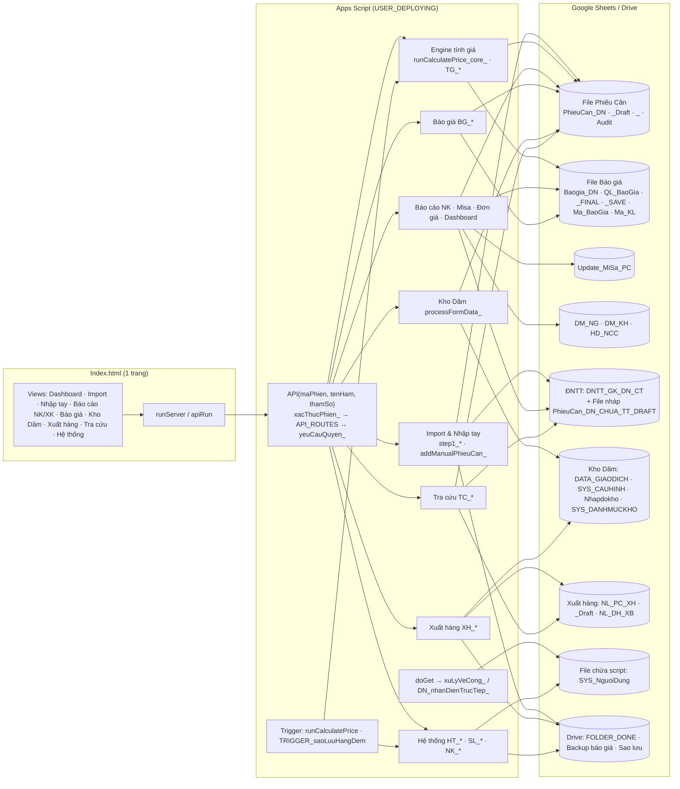
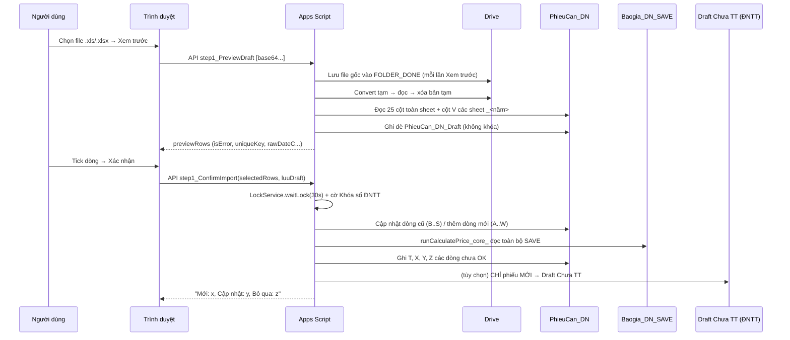

# 13 — Báo cáo kiểm toán Enterprise (28/09/2026)

> **Trạng thái: CHỈ BÁO CÁO — chưa sửa dòng code nào** (theo yêu cầu mục XI "Không sửa code ngay").
> Phạm vi: toàn bộ `Code.gs` (6.093 dòng, 199 hàm), `Config.gs` (1.296 dòng, 62 hàm), `Index.html` (5.604 dòng, ~160 hàm JS), `appsscript.json`, commit `099e3a8` trên nhánh `claude/vibrant-thompson-b9llb5`.
> Phương pháp: đọc toàn bộ mã nguồn máy chủ + đọc có chọn lọc giao diện (luồng gọi máy chủ, render, phân quyền, chống bấm lặp, XSS), đối chiếu 12 báo cáo kiểm toán trước (`01`→`12`).
> **Giới hạn trung thực:** không chạy được trên dự án Apps Script thật; bộ test mà các báo cáo trước nhắc tới (`test/`, `tools/`, "553 test") **không có trong repo** nên không chạy lại được. Mọi con số hiệu năng ở mục VI là **ước lượng theo số ô đọc/ghi và độ phức tạp**, không phải đo thực tế.

---

## 0. Tóm tắt điều hành

| Mức | Số lỗi mới phát hiện | Đã biết từ đợt trước, còn mở |
|---|:-:|:-:|
| **Critical** | 0 | 1 (ARCH-01 – trần 10 triệu ô/file) |
| **High** | 6 | 1 (ARCH-02) |
| **Medium** | 16 | 3 (SEC-03, BUG-004, SEC-01) |
| **Low** | 11 | – |

**5 rủi ro cần xử lý trước tiên (đều ảnh hưởng tiền/số liệu):**

1. **H-01 – Tính giá có thể lấy GIÁ CŨ** khi báo giá mới đổi dải khối lượng (mã KL) của cùng một Mã ĐG: dải cũ vẫn "Còn hiệu lực" tới 2050 và được dò trước.
2. **H-02 – Import lại (Cập nhật dòng cũ) không đồng bộ sang Draft Chưa TT của ĐNTT** → ĐNTT có thể lập thanh toán theo khối lượng/đơn giá cũ tới lần làm mới 7:30/13:00.
3. **H-03 – Ngày bắt đầu kỳ vét bãi mới bị khóa nhầm**: không nhập/sửa được phiếu Kho Dăm của đúng ngày chuyển kỳ.
4. **H-04 – Máy chủ tin dữ liệu trình duyệt khi Xác nhận import** (Mã chứng từ, khối lượng) → có thể tạo phiếu trùng (khác 1 dấu cách) hoặc chèn công thức vào ô số.
5. **H-05 – Sửa phiếu Kho Dăm chỉ kiểm tra khóa kỳ theo NGÀY MỚI**, không theo ngày gốc → lời gọi API tự dựng sửa được phiếu thuộc kỳ đã khóa.

**Điểm mạnh đã có (giữ nguyên):** cổng `API()` duy nhất + bảng quyền `API_ROUTES`; vé đăng nhập HMAC dùng 1 lần; `LockService` cho mọi luồng ghi; chống ghi nhầm dòng khi ĐNTT khóa sổ (CONCUR-01/02); đọc lại cột Y trước khi ghi giá (BUG-TG-01); `escapeHtml`/`jsAttr` nhất quán; vẽ bảng lớn theo lô; `sanitize_` ở hầu hết điểm nhập.

---

## I. Phân tích kiến trúc

### I.1 Sơ đồ module



### I.2 Luồng nghiệp vụ chính (Import phiếu cân nhập)



### I.3 Bản đồ dữ liệu (nguồn sự thật)

| Thực thể | Nơi ghi | Khóa | Ai ghi | Ai đọc |
|---|---|---|---|---|
| Phiếu cân nhập | `PhieuCan_DN` (27 cột A..AA) | Cột V `Số/Năm/NK` | Import, Nhập tay, Tính giá, Tra cứu (sửa), **ĐNTT** (AA, Y=OK, xóa dòng khi khóa sổ) | Báo cáo, Dashboard, Kho Dăm (TP), Báo giá (đã áp dụng) |
| Phiếu cân lưu trữ | `PhieuCan_DN_<năm>` | V | **Chỉ ĐNTT** | Báo cáo, kiểm tra trùng, Tra cứu |
| Bảng giá tính tiền | `Baogia_DN_SAVE` (dẫn xuất) | `id_ma` | `BG_lamMoiSave_` | Engine tính giá |
| Báo giá gốc | `Baogia_DN`, `QL_BaoGia` | `ID_BGCT` (8 hex), Số BG | BG_* | BG_coreLogicProcessor_ |
| Misa | `Update_MiSa_PC` (**ảnh chụp**, 1 bản dùng chung) | – | `copyDataWithFinalLookup_` | Báo cáo Misa, tải Excel |
| Kho Dăm | `DATA_GIAODICH` | `NK_/XK_yyyyMMdd_HHmmss_rand` | processFormData_ | Báo cáo tồn kho |
| Xuất hàng | `NL_PC_XH`, `NL_DH_XB` | `Số/Năm/XK`, STT | XH_* | Báo cáo XK, Tra cứu |
| Người dùng | `SYS_NguoiDung` + cache 60s | Email chuẩn hóa | HT_luuDanhSachQuyen_ | xacThucPhien_ mỗi lời gọi |
| Phiên | CacheService `phien_<64hex>` | mã phiên | taoPhien_ | xacThucPhien_ |

### I.4 Luồng trạng thái phiếu cân nhập (cột Y)

`""` (mới ghi) → `Test giá` / `Lỗi ĐK/Báo giá` (engine tính giá, tính lại mỗi lần import/nhập tay/trigger) → `OK` (**chỉ ĐNTT** ghi khi đóng thanh toán; từ đây webapp không đụng tới) → chuyển sang `PhieuCan_DN_<năm>` khi ĐNTT khóa sổ năm.

### I.5 Đồ thị gọi hàm chính (rút gọn)

- `API` → `xacThucPhien_` → `timNguoiDungTheoEmail_` → `DS_QUYEN_` → (cache | `SYS_NguoiDung`)
- `step1_ConfirmImport_` → `KS_thongBaoDNTTDangKhoaSo_`, `LT_bosungMaChungTuDaLuuTru_`, `ghiCapNhatPhieuCanGop_` → `PC_kiemTraDongConDung_`; `runCalculatePrice_core_` → `TG_docBaoGia_`, `TG_tinhGiaDong_`, `docCacDong_`, `ghiNhieuVung_`; `ghiVaoDraftChuaTT_`; `logAudit_`
- `BG_createQuote_ / BG_updateBaogiaRow_ / BG_deleteBaogiaRow_ / BG_deleteQuote_` → `BG_kiemTraSuaXoaNhieuNhom_` → `BG_coreLogicProcessor_`, `BG_getPhieuCanByMaDG_` → `BG_lamMoiSaveSauGhi_` → `BG_lamMoiSave_`
- `processFormData_` (khóa) → `xuLySuaXoaGiaoDich_` → `taiDanhSachKyVetBaiCache_`, `kiemTraKhoaKyVetBaiPure_`, `xuLyNhapSanPhamSanXuat_` (đọc **toàn bộ** PhieuCan_DN), `xuLyXacDinhDoKho_`
- `TC_suaPhieuNhap_ / TC_tinhLaiGia*` → `TC_chayCoKhoa_` → `runCalculatePrice_core_(chonDong)` → `TC_dongBoDraftChuaTT_`

### I.6 Trigger & sự kiện
- `TRIGGER_saoLuuHangDem` (1–2 giờ sáng), `runCalculatePrice` (theo giờ, nếu cài). Cả hai xác thực `triggerUid`.
- Giao diện: 1 listener/nút, bảng lớn dùng 1 listener ủy quyền; sự kiện `storage` để nhận phiên từ cửa sổ đăng nhập; `setInterval` 1,5 s dò phiên khi đang chờ đăng nhập (được dừng đúng lúc).

---

## II. Rà soát kiến trúc

| Tiêu chí | Đánh giá | Bằng chứng |
|---|---|---|
| Module hóa / SoC | Trung bình | Tiền tố module nhất quán (`BG_`, `XH_`, `TC_`, `KD_`…), nhưng 1 file nghiệp vụ 6.093 dòng, 1 file giao diện 5.604 dòng; ~250 thuộc tính `style=""` nội tuyến. |
| SRP | Yếu ở Import | `step1_PreviewDraft_` (200 dòng) = lưu Drive + convert + chuẩn hóa + đối soát + ghi Draft. `xuLySuaXoaGiaoDich_` (137 dòng) = khóa kỳ + quét phiếu cân + độ khô + chống trùng + ghi. |
| DRY | Yếu | **5 bộ phân tích ngày khác quy tắc**: `parseDate_`, `toDateObj_`, `chuanHoaNgay_`, `combineDateTime_`, `NK_ngay_` (năm 2 chữ số: 1 hàm đổi thành 20xx, hàm khác thành 19xx). Khối `LockService … waitLock … "Hệ thống đang bận"` lặp ~20 lần. Bộ lọc báo cáo lặp nguyên văn giữa `getBaoCaoTongHop_` và `getBaoCaoDonGia_`. 2 luồng Import (NK/XK) cùng khung. 8 hàm export cùng khuôn. |
| Magic number/string | Nhiều | `row[21]`, `getRange(r,22)`, `< 70` (Tấn→Kg), `0.45`, `0.0315`, `730` ngày, `"Test giá"`, `"OK"`, `"Đã hủy"`, `"Không có"`. |
| Hardcode | Có | `QUAN_TRI_CO_DINH` (2 Gmail), ID Sheet/Folder mặc định trong `Config.gs` (có cơ chế ghi đè – tốt). |
| Global state | Chấp nhận được | `PHIEN_HIEN_TAI_`, `ND_CACHE_DOC_SAN_`, `_API_ROUTES_CACHE_` sống trong 1 lượt thực thi. |
| Quy ước trả về | Không đồng nhất | Kho Dăm trả **chuỗi** có emoji, phần còn lại trả `{status,message}`; UI Kho Dăm dùng `alert()`, phần khác dùng toast. |
| Dependency Injection / test seam | Không có | Hàm gọi thẳng `SpreadsheetApp.openById` ở ~60 chỗ → khó test đơn vị. |
| Kiểm thử | **Thiếu trong repo** | Báo cáo 07 nêu 20 bộ/553 test + `tools/audit.js`, nhưng repo không có `test/`, `tools/`, `package.json`. Không tái lập được. |

**Chỉ số tổng quan (thang 10):** Bảo trì 5 · Mở rộng 5 · Độ phức tạp cao (≥10 hàm CC > 40) · Technical debt: cao (ngày tháng, chỉ số cột, file đơn khối) · Rủi ro vận hành: trung bình (khóa + CONCUR tốt; điểm yếu nằm ở đồng bộ ĐNTT/Misa và kiểm tra phía máy chủ).

---

## III → IX. Danh sách lỗi chi tiết

Mỗi mục: **Mức · Vị trí · Nguyên nhân · Ảnh hưởng · Giải pháp · Code cần sửa → Code mới · Lợi ích**. Code mới là **đề xuất** (chưa áp dụng), viết theo hướng tương thích ngược.

### High

#### H-01 · Engine tính giá có thể áp giá CŨ khi đổi dải khối lượng
- **Vị trí:** `Code.gs:3048-3053` (nhóm theo `ma + MIN + MAX`), `Code.gs:1157` (lấy dòng khớp đầu tiên), `Code.gs:2397` (`BG_addMaKL_` không kiểm tra chồng dải).
- **Nguyên nhân:** hiệu lực được "nối tiếp" theo nhóm `Mã ĐG + dải KL`. Báo giá mới cho mã X với dải `0_45` **không kết thúc** báo giá cũ của mã X dải `0_50` → dòng cũ còn hiệu lực tới 31/12/2050. `TG_tinhGiaDong_` duyệt danh sách theo thứ tự `Baogia_DN` và dừng ở dòng khớp đầu tiên → phiếu 40 tấn khớp cả 2, **dòng cũ nằm trước nên thắng**.
- **Tình huống:** 01/2026 lập X `0_50` = 1.000.000đ; 09/2026 lập X `0_45` = 1.100.000đ + `45_999` = 1.150.000đ. Phiếu 20/09, 40 tấn → tính 1.000.000đ (sai), bảng "Còn hiệu lực" hiện cả 2 dòng.
- **Ảnh hưởng:** sai tiền thanh toán, khó phát hiện (trạng thái vẫn "Test giá").
- **Giải pháp (không đổi dữ liệu cũ):** (1) Khi lưu báo giá: cảnh báo/chặn nếu cùng Mã ĐG còn dải KL khác **chồng lấn** đang hiệu lực; (2) `BG_addMaKL_` chặn dải chồng lấn; (3) engine: khi nhiều dòng cùng khớp, ưu tiên dòng có **ngày hiệu lực muộn nhất** (đúng ý nghĩa "báo giá mới thay báo giá cũ").
- **Code cần sửa → mới (`TG_tinhGiaDong_`):**
  ```js
  // cũ: for (const bg of listCungMa) { if (khớp) { giaFound = bg.price; break; } }
  // mới: chọn dòng khớp có start lớn nhất (báo giá mới nhất thắng)
  let tot = null;
  for (const bg of listCungMa) {
    if (_tsTrongKhoangHieuLuc_(ts, bg.start, bg.end) && klSoSanh > bg.minKl && klSoSanh <= bg.maxKl
        && (!tot || bg.start > tot.start)) tot = bg;
  }
  giaFound = tot ? tot.price : 0;
  ```
  ⚠️ Thay đổi kết quả tính cho phiếu **chưa OK** đang rơi vào trường hợp chồng dải → cần chạy báo cáo đối chiếu trước (xem XII) và **bạn duyệt nghiệp vụ**.
- **Lợi ích:** loại bỏ sai giá âm thầm.

#### H-02 · Import lại không đồng bộ Draft Chưa TT của ĐNTT
- **Vị trí:** `Code.gs:705` (`traKetQua` chỉ bật khi tick ô), `Code.gs:716-724` (chỉ `batchNew`).
- **Nguyên nhân:** nhánh "Cập nhật dòng cũ" đổi Ngày/Giờ/KL/Đại lý/Nguồn gốc và giá được tính lại, nhưng chỉ phiếu **mới** được ghi sang `PhieuCan_DN_CHUA_TT_DRAFT`. Tra cứu (`TC_*`) thì có `TC_dongBoDraftChuaTT_`, còn Import và Nhập tay (`addManualPhieuCan_`, `Code.gs:834`) thì không.
- **Ảnh hưởng:** ĐNTT chọn phiếu thanh toán theo KL/đơn giá cũ cho tới lần làm mới 7:30/13:00 → rủi ro chi sai.
- **Giải pháp:** sau khi tính giá trong import, luôn gọi `TC_dongBoDraftChuaTT_` (chỉ CẬP NHẬT dòng đã có trong Draft, không thêm mới) — hàm đã có, đã kiểm tra chống lệch dòng.
- **Code mới (`step1_ConfirmImport_`):**
  ```js
  priceResult = runCalculatePrice_core_(undefined, true);        // luôn lấy ketQua
  // ... sau khối ghi Draft phiếu mới:
  TC_dongBoDraftChuaTT_(dataSheet, priceResult && priceResult.ketQua); // cập nhật phiếu đã có trong Draft
  ```
- **Lợi ích:** ĐNTT luôn thấy đúng số liệu ngay sau import.

#### H-03 · Ngày chuyển kỳ vét bãi bị khóa nhầm
- **Vị trí:** `Code.gs:3252-3253`, `3263`, `3267-3272`, `4066`.
- **Nguyên nhân:** kỳ cũ được đóng "Đến: <ngày giờ bắt đầu kỳ mới>", khi đọc lại làm tròn `den` lên 23:59:59 và `tu` của kỳ mới xuống 00:00 → **ngày chuyển kỳ thuộc cả 2 kỳ**. `kiemTraKhoaKyVetBaiPure_` duyệt từ kỳ cũ nhất, gặp kỳ cũ (đã khóa) trước → trả "khóa".
- **Ảnh hưởng:** không thêm/sửa được phiếu Kho Dăm, độ khô của đúng ngày bắt đầu kỳ mới ("❌ Khóa bảo mật: Phiếu thuộc kỳ cũ!").
- **Giải pháp:** duyệt từ kỳ mới nhất (khớp cách `layThongSoVaTieuHaoCache_` đang chọn kỳ mới nhất).
- **Code mới:**
  ```js
  function kiemTraKhoaKyVetBaiPure_(ngayTime, arrKyCache) {
    var t = new Date(ngayTime).setHours(0,0,0,0);
    for (var i = arrKyCache.length - 1; i >= 0; i--) {           // kỳ mới nhất trước
      if (t >= arrKyCache[i].tu && t <= arrKyCache[i].den) return arrKyCache[i].isLocked;
    }
    return false;
  }
  ```
- **Lợi ích:** hết chặn nhầm; không đổi dữ liệu.

#### H-04 · Xác nhận import tin dữ liệu trình duyệt
- **Vị trí:** `Code.gs:573` (`item.isError`), `579` (`uniqueKey` không trim/không tính lại), `645`, `663` (KL ghi thẳng, không ép số), `665`.
- **Nguyên nhân:** `step1_ConfirmImport_` dùng lại nguyên `uniqueKey`, `klCan1/2`, `klHangGoc`, `isError` từ trình duyệt. `duplicateMap` dùng khóa đã `trim()`.
- **Ảnh hưởng (cần tài khoản Nhân viên + lời gọi tự dựng):** `"7107/2026/NK "` (thêm dấu cách) → không thấy trùng → **phiếu trùng** chen vào sổ; `klHangGoc: "=IMPORTXML(...)"` → **công thức sống** trong PhieuCan_DN; `rawDateC` rác → `Invalid Date` làm hỏng cả lô.
- **Giải pháp:** máy chủ tự tính lại khóa từ `soPhieu` + năm `rawDateC`, bắt buộc ngày hợp lệ, ép số hữu hạn ≥ 0.
- **Code mới:**
  ```js
  const soHuuHan_ = v => { const n = Number(v); return isFinite(n) && n >= 0 ? n : null; };
  // trong vòng lặp:
  const dateC = item.rawDateC ? new Date(item.rawDateC) : null;
  const dateD = item.rawDateD ? new Date(item.rawDateD) : null;
  if (!dateC || isNaN(dateC) || !dateD || isNaN(dateD)) { countSkip++; continue; }
  const uniqueKeyMaCT = String(item.soPhieu || "").trim() + "/" + dateC.getFullYear() + "/NK";
  const kl1 = soHuuHan_(item.klCan1), kl2 = soHuuHan_(item.klCan2), klH = soHuuHan_(item.klHangGoc);
  if (klH === null || klH === 0) { countSkip++; continue; }
  ```
- **Lợi ích:** chặn phiếu trùng và công thức độc; không đổi kết quả với dữ liệu hợp lệ.

#### H-05 · Sửa phiếu Kho Dăm: kiểm tra khóa kỳ theo ngày MỚI, bỏ qua ngày GỐC
- **Vị trí:** `Code.gs:3645-3647`.
- **Nguyên nhân:** `ngayCheck = dataEdit.ngay || ngàyGốc` → khi sửa, chỉ ngày người dùng gửi lên được kiểm tra.
- **Ảnh hưởng:** giao diện ẩn nút Sửa với phiếu kỳ đã khóa, nhưng lời gọi API tự dựng (`hanhDong:"SUA"`, `ngay` thuộc kỳ mở) sửa/"kéo" được phiếu của kỳ đã chốt → tồn kho kỳ cũ thay đổi.
- **Code mới:**
  ```js
  if (rowIdx > -1 && kiemTraKhoaKyVetBaiPure_(data[rowIdx - 1][1], arrKyCache))
    return "❌ Khóa bảo mật: Phiếu gốc thuộc kỳ đã khóa!";
  if (kiemTraKhoaKyVetBaiPure_(ngayCheck, arrKyCache)) return "❌ Khóa bảo mật: Phiếu thuộc kỳ cũ!";
  ```
- **Lợi ích:** khóa kỳ được bảo vệ ở máy chủ (defense-in-depth).

#### H-06 · Báo cáo Misa dùng 1 ảnh chụp chung + nhận dòng không có ngày
- **Vị trí:** `Code.gs:1045` (`if (ngayPhieu && …) continue;`), `Code.gs:1062` (xóa + ghi đè 1 sheet dùng chung), `Code.gs:1719`, `988`.
- **Nguyên nhân:** (a) dòng có Ngày cân 1 rỗng/không đọc được **không bị loại** → xuất hiện trong MỌI kỳ Misa; (b) `Update_MiSa_PC` là 1 sheet cho mọi người: A tạo tháng 8, B tạo tháng 9 ngay sau, A bấm tải Excel → nhận dữ liệu tháng 9; sheet không lưu "khoảng ngày / người tạo / lúc tạo".
- **Ảnh hưởng:** hạch toán trùng/sai kỳ vào MISA.
- **Giải pháp:** loại dòng không có ngày hợp lệ; ghi siêu dữ liệu (khoảng ngày, người, thời điểm) vào 1 ô/Developer Metadata và hiển thị + kiểm tra trước khi tải; tùy chọn: trả Excel trực tiếp theo khoảng ngày thay vì qua sheet chung.
- **Code mới:** `if (!ngayPhieu || ngayPhieu < start || ngayPhieu > end) continue;` + `ssTarget.getParent().addDeveloperMetadata("MISA_SNAPSHOT", JSON.stringify({tu, den, email, luc}))`.

### Medium

| ID | Tên lỗi | Vị trí | Nguyên nhân → Ảnh hưởng | Giải pháp đề xuất |
|---|---|---|---|---|
| M-01 | File tạm xuất Excel/PDF không bao giờ xóa | `Code.gs:1791-1806`, `996`, `1943`, `2258`, `3138` | Mỗi lần xuất/in phiếu tạo 1 Spreadsheet vĩnh viễn trong `FOLDER_DONE` (hàng nghìn file/năm) → Drive rối, tốn quota, lẫn với file gốc import. | Trong `chuyenLinkXuatThanhFile_` (Config.gs:1089) sau khi tải thành công: `DriveApp.getFileById(id).setTrashed(true)`; + trigger dọn file `BaoCao_*`/`PhieuNhapKho_*` > 7 ngày. |
| M-02 | Mỗi lần "Xem trước" lưu thêm 1 bản file gốc | `Code.gs:166`, `4628` | Xem trước 3 lần = 3 bản giống nhau trong Done; lưu cả khi người dùng hủy. | Lưu file gốc ở bước Xác nhận, hoặc đặt tên theo MD5 nội dung (`Utilities.computeDigest`) và bỏ qua nếu đã có. |
| M-03 | `toDateObj_` đọc năm 2 chữ số thành 19xx | `Code.gs:2108` | `"25/07/26 08:00"` → năm **1926** (trong khi `chuanHoaNgay_` hiểu 2026) → Mã CT `…/1926/NK`, báo cáo lệch. | `if (y < 100) y += 2000;` + gom 5 hàm ngày về 1 thư viện `NGAY_*`. |
| M-04 | Múi giờ của file convert tạm chưa được ép | `Code.gs:170-172` | Nếu ô Excel là datetime thật, giá trị đọc theo múi giờ mặc định tài khoản Admin; khác `Asia/Ho_Chi_Minh` → lệch giờ/ngày, lệch năm quanh 31/12. **Cần xác minh trên tài khoản thật.** | `SpreadsheetApp.openById(tempFile.id).setSpreadsheetTimeZone(Session.getScriptTimeZone())` trước khi đọc. |
| M-05 | Xuất hàng: `tuNgay/denNgay` không sanitize | `Code.gs:4931`, `5042` | Chuỗi `"=HYPERLINK(...)"` thành công thức trong `NL_DH_XB`. | Chỉ nhận `yyyy-MM-dd` (regex) rồi ghi Date; hoặc `sanitize_`. |
| M-06 | In phiếu PDF: chuỗi đã lưu thành công thức lại | `Code.gs:1970-1980` | Ô lưu `'=abc` đọc ra `=abc`, `setValue` vào file tạm → thành công thức. | Bọc `chongCongThuc_()` cho mọi `setValue` chuỗi. |
| M-07 | Xóa Mã báo giá / Mã KL không kiểm tra đang dùng | `Code.gs:2358`, `2430` | Xóa mã đang có trong `Baogia_DN`/phiếu cân → báo cáo "Không tìm thấy trong danh mục", mất diễn giải. | Chặn nếu còn dòng `Baogia_DN` hoặc phiếu cân chưa OK dùng mã; hoặc xóa mềm (cột Trạng thái). |
| M-08 | Thao tác tạo mới không idempotent | `BG_createQuote_:2899`, `XH_saveDonHang_:4878`, Kho Dăm `3750` | Mất mạng sau khi máy chủ đã ghi → người dùng bấm lại → **báo giá/đơn hàng/phiếu kho trùng**. Overlay chặn chuột nhưng phím Enter vẫn kích hoạt nút đang focus. | Trình duyệt sinh `requestId` (UUID) cho mỗi lần bấm; máy chủ lưu `CacheService` 10 phút, gặp lại thì trả kết quả cũ. Vô hiệu nút khi đang gửi. |
| M-09 | Báo cáo Kỳ vét bãi giữ khóa toàn hệ thống | `Index.html:3980` → `processFormData_` `Code.gs:4461` | Báo cáo chỉ đọc nhưng chạy trong Script Lock → mọi import/tính giá/báo giá phải chờ. | Gọi thẳng route XEM `layBaoCaoTonKho`/thêm route `layBaoCaoTheoKyVetBai` (X) không khóa. |
| M-10 | "Nhập TP dăm" quét toàn bộ PhieuCan_DN + `Utilities.formatDate` mỗi dòng | `Code.gs:3455-3471` | 50.000 dòng × 27 cột đọc + 50.000 lượt `formatDate`, **trong lúc giữ khóa**. | Đọc 2 cột B, J; so ngày bằng số học (`dinhDangGMT7_` hoặc so mốc ms). |
| M-11 | Nhật ký `Audit` tăng vô hạn trong file Phiếu Cân | `Code.gs:2126-2149` | Chung trần 10 triệu ô với `PhieuCan_DN` (ARCH-01); mỗi `logAudit_` mở lại Spreadsheet. | Ghi Audit sang file riêng (Liên kết dữ liệu) + xoay vòng theo năm; cache `ss` trong lượt. |
| M-12 | Sheet xem trước dùng chung, không khóa | `Code.gs:293-308`, `4727-4741` | 2 người Xem trước cùng lúc → `PhieuCan_DN_Draft` lẫn dữ liệu 2 lô (chỉ ảnh hưởng hiển thị trên sheet). | Ghi Draft kèm cột email/phiên, hoặc bỏ ghi sheet (bảng xem trước đã có trên web). |
| M-13 | Bảng xem trước import vẽ toàn bộ dòng | `Index.html:2496-2521` | 10.000–50.000 dòng → DOM lớn, treo tab (khác 5 báo cáo đã vẽ theo lô). | Dùng `veBangTheoLo` như PERF-08. |
| M-14 | Chia sẻ Drive gọi `getFileById` trong vòng lặp lồng | `Config.gs:461-473` | 10 tài nguyên × 50 người = 500 lần lấy file → chậm, dễ chạm quota Drive. | Lấy `resource` 1 lần/tài nguyên (đưa ra ngoài vòng người dùng). |
| M-15 | Xuất hàng: số Cân lần 1/2 không theo Locale, không quy Tấn→Kg | `Code.gs:4691-4692` | `"27.020"` (VN) → 27,02; NK dùng `parseSoTheoLocale_` + quy tắc `<70`, XK thì không → số liệu 2 luồng lệch quy ước. | Dùng `parseSoTheoLocale_`; thống nhất quy tắc Tấn/Kg (cần bạn xác nhận). |
| M-16 | Phiếu nhập tay không vào Draft Chưa TT | `Code.gs:834` | Phiếu nhập tay chỉ xuất hiện bên ĐNTT sau lần làm mới 7:30/13:00. | Thêm ô tùy chọn như Import, dùng lại `ghiVaoDraftChuaTT_`. |

### Low

| ID | Tên lỗi | Vị trí | Giải pháp |
|---|---|---|---|
| L-01 | Xuất hàng lưu Ngày giờ cân dạng **chuỗi**, Nhập kho lưu **Date** | `Code.gs:4791-4792` | Giữ tương thích; thêm cột ẩn timestamp số để lọc/sắp xếp. |
| L-02 | `xuLySuaXoaDoKho_` XOA không thấy dòng → trả `undefined`, log "OK" | `Code.gs:4147-4151` | `return "❌ Không tìm thấy độ khô ngày " + target;` |
| L-03 | Thêm kho không kiểm tra trùng tên | `Code.gs:4005-4008` | Chặn trùng `tenKho` (không phân biệt hoa thường). |
| L-04 | Lưu danh sách người dùng không khóa | `Config.gs:1247` | Bọc `LockService` (2 Admin lưu cùng lúc mất thay đổi). |
| L-05 | Nonce vé Cổng kiểm tra rồi mới ghi (không nguyên tử) | `Config.gs:1173-1174` | Bọc Script Lock ngắn (1–2 s) quanh get/put nonce. |
| L-06 | `Folder.addFile/removeFile` đã deprecated | `Code.gs:1004,1803,2017,2269,3158` | `DriveApp.getFileById(id).moveTo(folder)`. |
| L-07 | Sắp xếp Mã CT theo chuỗi (`"10/…" < "9/…"`) | `Code.gs:1461,1687,1774` | So `localeCompare(…, {numeric:true})`. |
| L-08 | Báo giá: không chặn nhóm trùng (cùng mã + KL + hiệu lực) trong 1 phiếu | `Code.gs:2907` | Kiểm tra trùng trước khi ghi; ID_BGCT 8 hex không kiểm tra va chạm. |
| L-09 | Thông báo lỗi/thành công Kho Dăm dùng `alert()` (11 chỗ), phần khác dùng toast | `Index.html:4081-4753` | Chuẩn hóa về `toast`/dialog chung. |
| L-10 | Kho Dăm "Hoàn thành đơn hàng" đọc `DATA_GIAODICH` 2 lần | `Code.gs:3844-3851` | Gộp `timKhoNguonTCLonNhat_` vào `tongHopSoLieuKhoXuatBan_`. |
| L-11 | `xoaCacDong_` dùng `indexOf` trong `filter` (O(n²)) | `Code.gs:870` | Dùng `Set`. |

### Đã biết từ đợt trước, vẫn mở (giữ nguyên đánh giá)
ARCH-01 (Critical với mục tiêu 500.000 dòng), ARCH-02 (High – báo cáo không lọc ngày trả toàn lịch sử), SEC-03 (Chỉ xem gọi `BG_updateHieuLuc/BG_showAllData` chiếm khóa + ghi sheet dẫn xuất), BUG-004 (2 người sửa cùng phiếu Kho Dăm – lost update), SEC-01 (`ALLOWALL` cho Portal).

---

## IV. Đồng bộ dữ liệu

| Cặp dữ liệu | Hiện trạng | Mất / sai / trùng / lệch | Mục lỗi |
|---|---|---|---|
| Import → Draft xem trước | Ghi đè sheet chung, không khóa | Lẫn lô khi 2 người | M-12 |
| Import → PhieuCan_DN | Khóa + CONCUR | Trùng khi khóa do trình duyệt gửi khác 1 dấu cách | H-04 |
| PhieuCan_DN → Draft Chưa TT (ĐNTT) | Chỉ phiếu mới khi import; Tra cứu có đồng bộ | **Lệch** KL/giá sau import lại, nhập tay | H-02, M-16 |
| Báo giá gốc → SAVE (engine) | Làm mới trong cùng khóa (BUG-BG-01 đã sửa) | Giá cũ thắng khi đổi dải KL | H-01 |
| Báo giá → phiếu cân đã tính | Không tự tính lại khi lưu báo giá | Phiếu "Lỗi ĐK/Báo giá" chờ lần import/trigger kế tiếp | Đề xuất X |
| SAVE ↔ FINAL | FINAL chỉ dựng lại khi xem tab Hiệu lực | Xuất "FINAL" có thể dùng bản cũ nếu chưa mở tab | Low |
| PhieuCan_DN → Update_MiSa_PC | Ảnh chụp thủ công, 1 sheet chung | Sai kỳ, dòng không ngày lặp mọi kỳ | H-06 |
| ĐNTT ↔ webapp (khóa sổ) | Cờ Developer Metadata + kiểm tra dòng đích | Tốt | – |
| Kho Dăm ↔ Phiếu cân (TP) | Đọc trực tiếp PhieuCan_DN theo ngày | Không gồm sheet lưu trữ (đúng vì cùng năm) | – |
| Dashboard / Báo cáo / Tra cứu | Đọc trực tiếp, không cache dữ liệu giao dịch | Đúng thời điểm | – |
| Người dùng (sheet ↔ cache 60 s) | Sửa trên web xóa cache ngay | Sửa thẳng sheet: tối đa 60 s | Chấp nhận |
| Audit | `appendRow` nguyên tử | Không mất; không giới hạn dung lượng | M-11 |
| Rollback | Không có giao dịch nhiều sheet | Import: ghi PhieuCan xong, lỗi ở bước tính giá/Draft → dữ liệu đã ghi không quay lui (có log) | Đề xuất X (hàng đợi + đánh dấu lô) |

---

## V. Trùng lặp

| Loại | Vị trí | Nguyên nhân | Mức | Giải pháp |
|---|---|---|---|---|
| Duplicate Record (phiếu cân) | `step1_ConfirmImport_` | Khóa từ trình duyệt | High | H-04 |
| Duplicate Transaction (báo giá, đơn hàng, phiếu kho) | M-08 | Không idempotent | Medium | `requestId` |
| Duplicate File / Upload | Done: mỗi Xem trước + mỗi export | M-01, M-02 | Medium | Hash + dọn file tạm |
| Duplicate Business Logic (giá) | 2 dòng báo giá cùng khớp | H-01 | High | Ưu tiên báo giá mới nhất |
| Duplicate Validation / Parse ngày | 5 hàm | Lịch sử vá từng chỗ | Medium | Thư viện ngày duy nhất |
| Duplicate Function / Code | 2 luồng Import, 8 export, 2 bộ lọc báo cáo, ~20 khối khóa | Sao chép | Medium | `voiKhoa_(fn)`, `taoFileXuat_(cauHinh)`, `locPhieuCan_(filters)` |
| Duplicate Lookup | `TC_timPhieuNhap_` vs `exportPhieuCanPDF_` (tìm phiếu theo Mã CT) | 2 cách | Low | Dùng chung `TC_timPhieuNhap_` |
| Duplicate ID | ID_BGCT 8 hex, `KHO_<ms>`, `NK_…_rand4` | Không kiểm va chạm | Low | Kiểm tra tồn tại trước khi ghi |
| Duplicate Document Number | Số BG `yyyyMMdd-NNN`, STT đơn hàng | Sinh trong khóa – an toàn | – | – |
| Duplicate Sheet | `PhieuCan_DN_Draft`, `NL_PC_XH_Draft` dùng chung | Thiết kế | Low | M-12 |
| Duplicate Trigger | `HT_luuCauHinhSaoLuu_` xóa rồi tạo lại | An toàn | – | – |
| Duplicate google.script.run / Listener | 1 wrapper `runServer`; listener ủy quyền | Tốt | – | – |
| Duplicate CSS | Bộ class `#view-khodam .*` song song bộ chung; ~250 `style=""` | Sáp nhập module cũ | Low | Gộp token CSS |

---

## VI. Hiệu năng (ước lượng)

Giả định Sheets đọc ~150–300 nghìn ô/giây, mỗi lệnh gọi dịch vụ ~50–300 ms. `N` = số dòng `PhieuCan_DN` đang theo dõi.

| Luồng | Đọc/ghi mỗi lần | N = 1.000 | 10.000 | 50.000 | Ghi chú |
|---|---|---|---|---|---|
| Xem trước import | 25·N ô + convert Drive | ~3–6 s | ~5–8 s | ~10–15 s | Convert Drive chiếm phần lớn |
| Xác nhận import + tính giá | (25+26)·N ô + SAVE | ~2–4 s | ~5–8 s | ~15–30 s (trong khóa) | Người khác thấy "đang bận" nếu > 30 s |
| Nhập tay 1 phiếu | 1·N + 26·N ô | ~1–2 s | ~3–4 s | ~8–12 s | Tính giá lại mọi phiếu chưa OK |
| Nhập TP dăm (M-10) | 27·N ô + N lượt `formatDate` | ~2 s | ~10 s | **~40–60 s** (trong khóa) | Nguy cơ cao nhất |
| Báo cáo không lọc ngày | 27·(N+lưu trữ) ô | nhanh | vài giây | ARCH-02 | Nguy cơ vượt 6 phút ở quy mô lớn |
| Tra cứu | 27·N ô | nhanh | ~2 s | ~6–8 s | Đã tối ưu PERF-TC |
| Xem trước 50.000 dòng trên trình duyệt | DOM toàn bộ | ổn | chậm | **treo tab** | M-13 |

**Độ phức tạp đáng chú ý:** hầu hết O(N); O(n·m): `BG_exportFileSmart_` (`filteredIds.includes`), chia sẻ Drive (M-14); O(n²): `xoaCacDong_` (L-11). Không thấy O(n³).
**Đề xuất:** cột chỉ mục (Mã CT → dòng) cache theo `getLastRow`; đọc đúng cột cần; `Set/Map` thay `includes/indexOf`; debounce ô lọc; hàng đợi (queue) cho tính giá hàng loạt; phân trang máy chủ cho báo cáo (ARCH-02).

---

## VII–VIII. Giao diện & trải nghiệm

| Hạng mục | Hiện trạng | Đề xuất |
|---|---|---|
| Responsive | 3 media query ở 820 px; sidebar chuyển thành hàng ngang; bảng cuộn ngang | Thêm mốc 480 px; bảng dạng thẻ trên điện thoại cho Tra cứu/Kho Dăm |
| Dark mode | Không có (token `:root` sẵn, dễ thêm) | `@media (prefers-color-scheme: dark)` đổi token |
| Zoom 125–200% | Sidebar `position:sticky;height:100vh` — nội dung menu dài bị cắt ở 200% | `overflow-y:auto` cho sidebar |
| Sticky header | Có (`th` sticky, dòng tổng sticky) | – |
| Accessibility | 144 `<label>`, **0** có `for=`; 2 `aria-*`; nhiều nút chỉ emoji | Gắn `for`/`aria-label`; vòng focus trong modal; `role="status"` cho toast |
| Thông báo | Toast (đa số) + `alert()` (Kho Dăm) + `confirm()` (20 chỗ) | 1 hệ dialog thống nhất |
| Loading | Overlay toàn màn hình; chưa có skeleton | Skeleton cho Dashboard/báo cáo |
| Chống bấm lặp | Overlay; Enter vẫn kích hoạt nút | Vô hiệu nút + `requestId` (M-08) |
| Thao tác rườm rà | Import: Xem trước → tick → Xác nhận là hợp lý; Báo giá xong phải chờ import/trigger mới cập nhật giá phiếu "Lỗi ĐK/Báo giá" | Sau khi lưu báo giá: gợi ý "Tính lại N phiếu đang Lỗi ĐK/Báo giá khớp mã này" |
| Thông minh hơn | – | Cảnh báo `|Cân1 − Cân2| ≠ KL Hàng`; cảnh báo Ngày cân 2 < Ngày cân 1 (hiện không kiểm tra ở cả Import lẫn Nhập tay) |

---

## IX. Bảo mật

| Hạng mục | Kết quả | Ghi chú |
|---|---|---|
| Authentication | ✅ | HMAC vé 5 phút, nonce 1 lần (L-05 race nhỏ), phiên 12 h/trượt 6 h |
| Authorization | ✅ | `API_ROUTES` + 4 mức quyền; hàm nghiệp vụ kết thúc `_` |
| Server-side validation | ⚠️ | H-04, H-05, M-05 — máy chủ còn tin trình duyệt ở vài luồng ghi |
| XSS / HTML Injection | ✅ | `escapeHtml`/`jsAttr`; nội suy `${}` còn lại là giá trị nội bộ |
| Formula/CSV Injection | ⚠️ | Còn H-04 (ô số), M-05, M-06 |
| CSRF | ✅ không áp dụng | Cần mã phiên |
| Clickjacking | ⚠️ SEC-01 | `ALLOWALL` cho Portal |
| Token | ⚠️ Low | Mã phiên trong `localStorage` |
| Spreadsheet/Folder ID | ✅ | Chỉ Quản trị xem/sửa Liên kết dữ liệu |
| Drive access | ⚠️ Low | `HT_thuHoiQuyenTaiNguyen_` nhận `id` tùy ý (chỉ Quản trị) — nên giới hạn trong danh sách tài nguyên |
| Scope OAuth | ⚠️ | `drive` toàn quyền (cần cho convert/sao lưu); `access: ANYONE` — chấp nhận vì có cổng |
| Hardcode email | ⚠️ | `QUAN_TRI_CO_DINH` trong mã nguồn |
| Log/Audit | ✅ | Ghi email người thực hiện; cắt 45.000 ký tự; chống công thức. Thiếu xoay vòng (M-11) |

---

## X. Đề xuất nâng cấp (Enterprise / Commercial)

| Ưu tiên | Hạng mục | Giá trị | Ghi chú kỹ thuật |
|---|---|---|---|
| 1 | **Idempotency + hàng đợi ghi** | Hết trùng khi mất mạng/bấm lặp | `requestId` + CacheService; `Queue` sheet cho tính giá hàng loạt chạy bằng trigger |
| 1 | **Kiểm thử trong repo + CI** | Tái lập được mọi con số | Đưa `test/` (Jest + giả lập GAS) vào repo, GitHub Actions chạy mỗi PR; `clasp` để deploy |
| 1 | **Version History / Audit chi tiết** | Truy vết sửa phiếu, báo giá | Lưu trước/sau dạng JSON vào Audit (file riêng) |
| 2 | Tự tính lại phiếu "Lỗi ĐK/Báo giá" sau khi lưu báo giá | Bớt thao tác | Gọi `runCalculatePrice_core_(chonDong theo mã)` trong cùng khóa |
| 2 | Import Wizard | Ít lỗi file | Bước ánh xạ cột theo tên (như Xuất hàng), kiểm tra KL, ngày, trùng |
| 2 | Monitoring & Log Viewer | Phát hiện sớm lỗi | Đã có Nhật ký; thêm bảng "Lỗi 24 h", thời gian chạy từng API (Stackdriver đã bật) |
| 2 | Auto Backup có kiểm tra khôi phục | An toàn dữ liệu | Đã có sao lưu đêm; thêm kiểm tra định kỳ mở bản sao + đếm dòng |
| 3 | Conflict Resolution (optimistic lock) | Hết lost update (BUG-004) | Cột "Phiên bản"/timestamp, so trước khi ghi |
| 3 | Offline / PWA / IndexedDB / Service Worker | Giới hạn | HtmlService chạy trong iframe `googleusercontent.com`, **không đăng ký Service Worker được**; chỉ khả thi cache nhẹ bằng IndexedDB cho danh mục + nháp nhập tay (Auto Save/Crash Recovery của form) |
| 3 | Realtime Sync / Notification | Trung bình | Không có WebSocket; dùng poll 30–60 s cho Dashboard hoặc email/Chat webhook khi có lỗi |
| 3 | Undo/Redo | Thấp | Chỉ hợp lý cho form nháp phía trình duyệt; với dữ liệu sổ sách nên dùng "phiếu điều chỉnh" + Version History |
| 4 | Chuyển dữ liệu giao dịch sang BigQuery/Cloud SQL | Vượt ARCH-01 | Khi > 300.000 phiếu hoặc cần nhiều người ghi đồng thời |

---

## XII. Kế hoạch sửa (khi bạn duyệt)

**Nguyên tắc:** không đổi tên hàm công khai, không đổi cấu trúc sheet/cột, không đổi `API(maPhien, tenHam, thamSo)`; mỗi thay đổi có comment `// FIX <ID>`, dòng CHANGELOG, test case, cách quay lui.

| Đợt | Mục | Cần bạn quyết định? | Test case chính | Rollback |
|---|---|---|---|---|
| A (an toàn, không đổi kết quả hợp lệ) | H-02, H-03, H-04, H-05, M-03, M-05, M-06, L-02, L-04, L-07 | Không | Import lại phiếu đã có trong Draft → Draft cập nhật KL/giá; phiếu ngày chuyển kỳ lưu được; khóa `"…/NK "` bị từ chối; `klHangGoc:"=1+1"` bị từ chối; sửa phiếu kỳ khóa qua API bị chặn; `"25/07/26"` → 2026 | Dán lại 3 file của commit `099e3a8` + New version |
| B (đổi hành vi, cần duyệt) | **H-01** (ưu tiên báo giá mới nhất + chặn dải chồng), H-06 (Misa), M-01 (xóa file tạm), M-02, M-07, M-08, M-09, M-15, M-16 | **Có** | Trước khi bật H-01: chạy hàm chỉ-đọc liệt kê phiếu chưa OK có ≥ 2 dòng báo giá khớp → bạn xem danh sách | Như trên; H-01 có cờ `PropertiesService` bật/tắt |
| C (hiệu năng/UI) | M-10, M-11, M-12, M-13, M-14, L-06, L-09…L-11, a11y, dark mode | Không | Đếm lượt gọi Sheets trước/sau; Chromium 50.000 dòng xem trước | Như trên |

---

## XIII. Kiểm tra cuối (kế hoạch — chưa chạy)

Không có môi trường Google thật trong phiên này và bộ test cũ không có trong repo, nên **chưa thể khẳng định** "không còn lỗi Critical/Race/Duplicate". Sau khi sửa, cần:

1. Khôi phục/viết bộ test Jest giả lập GAS **vào repo** (Regression, Race condition với khóa bị giữ, Duplicate, Data integrity, Load 1.000/10.000/50.000 dòng đếm lượt gọi).
2. UI test Playwright (Chromium có sẵn): xem trước 50.000 dòng, 125/150/200 % zoom, 375 px, phím Enter khi đang gửi.
3. Chạy thử trên **bản sao** 4 Spreadsheet (Liên kết dữ liệu trỏ sang bản sao): import 3 file thật, import lại file đã sửa, đối chiếu Draft ĐNTT, tạo báo giá đổi dải KL, chuyển kỳ vét bãi.
4. Theo dõi Executions/Quota 1 tuần sau deploy.

---

## CHANGELOG
- 28/09/2026 — Thêm báo cáo kiểm toán Enterprise (tài liệu, không đổi mã nguồn).
